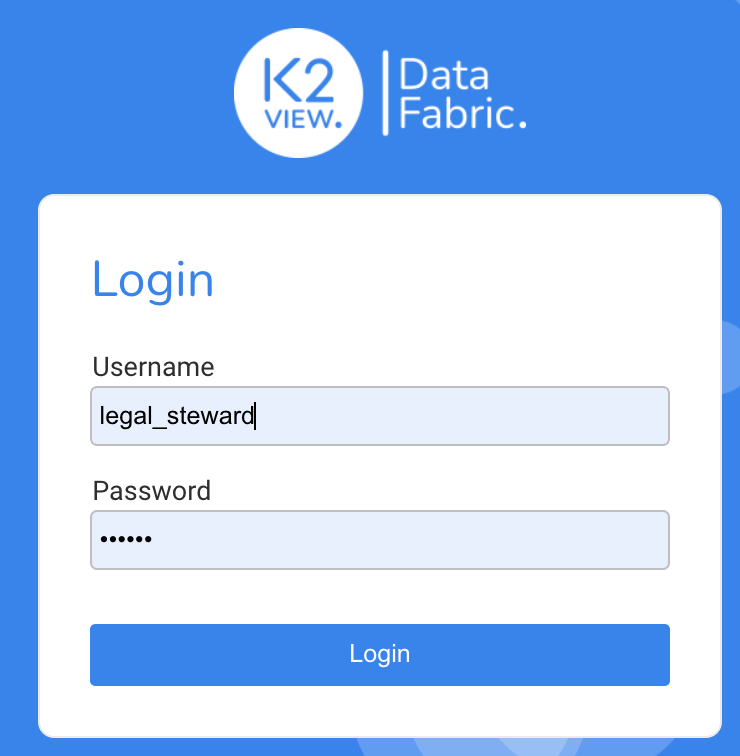
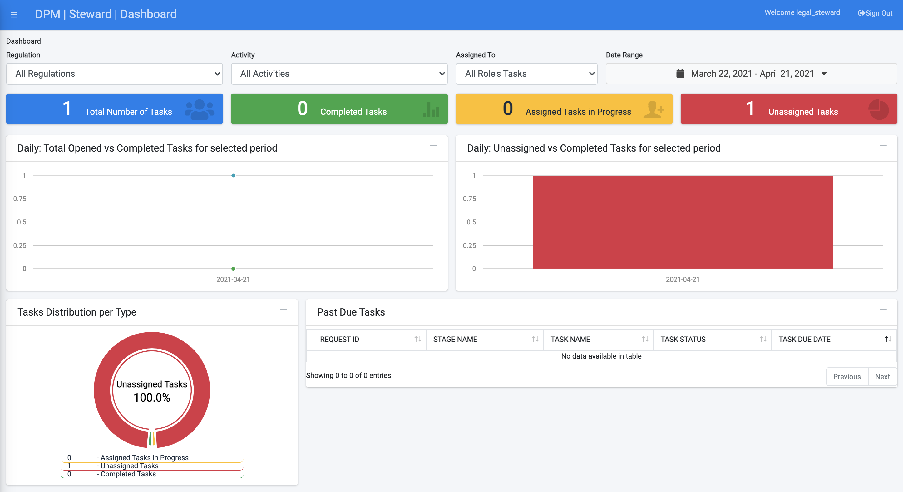
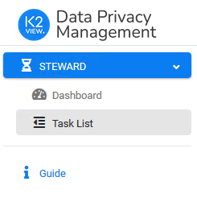
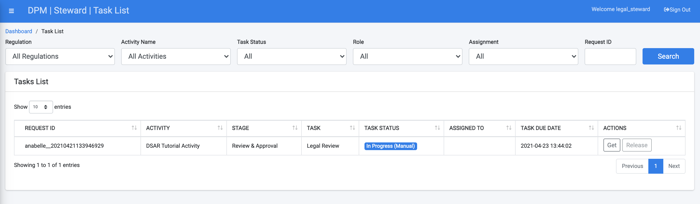
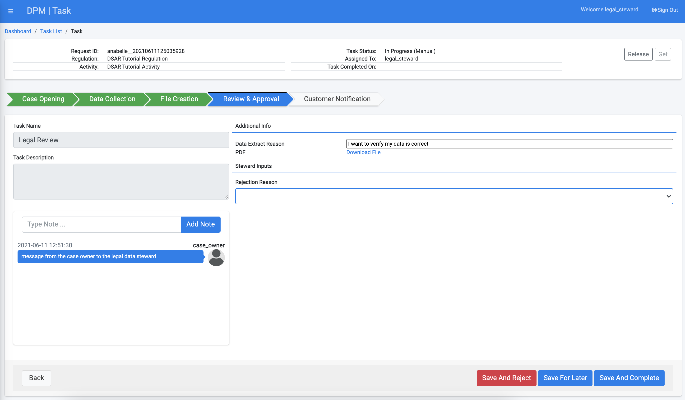

## Legal Data Steward Reviews Results

In this tutorial, we will guide you through the activities that a data steward performs as part of the request fulfillment process. 

Data Stewards are resources from different company departments, each with its area of responsibility and tasks. In the flow we have created for this tutorial, we have defined that a data steward from the legal department should review the DSAR response before it can be communicated to the customer. 

Login as a user with a Steward role using the following credentials.

- **Username**: legal_steward
- **Password**: k2view

The DPM system displays the Data Steward Dashboard. The Dashboard should be mostly empty, because the only Request submitted so far is the DSAR Request you submitted in the first tutorial section.  

On the left side of the screen, the Data Steward menu options display. 

Select **Task List**. The list of Tasks that are under the responsibility of this Steward team displays.

It currently shows only Tasks related to the Request we have submitted during this tutorial. Observe that this includes the Task that should be performed by the Legal Data Steward with **Risk/Status** marked as "In progress (Manual)".

**Note**: If the Task does not appear in the list when you logged in as a Legal Data Steward, then the automatic steps that proceeded it may not be completed. Allow a few more minutes to pass and refresh the list.

Click the Request line in the table to display the details for this Task.

This opens the Task that includes information that the Data Steward should review. Click the  button at the top-right of this screen to take ownership of the Task. As a steward, review the information that was gathered from all source systems for this customer by clicking on the PDF link and downloading the file with the collected information. 

Compare the data that was collected by the DPM system with the data in the source systems for the requesting customer. 

Once you confirm the data is correct, click  to prompt the system to move the Request to the next Task in the fulfillment process.

Close the Task details screen and logout from the DPM.

