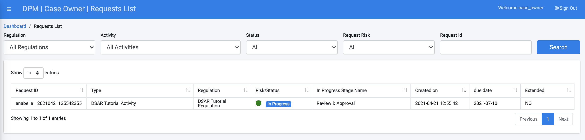
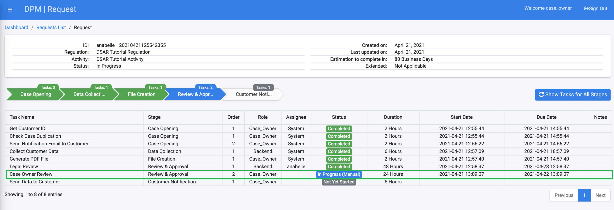
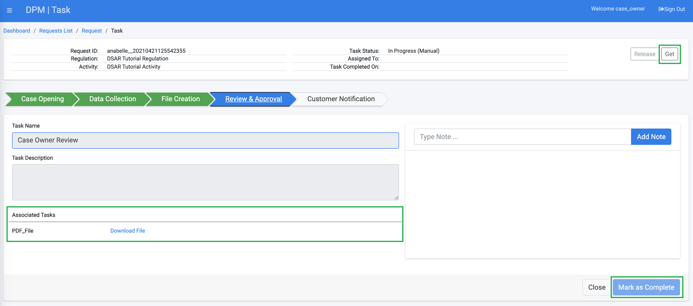

## Case Owner Reviews Results

When we built the tutorial Flow that fulfills the DSAR Request, we defined that the Task following the Legal team review would be a Case Owner review. 

The Case Owner review can be performed similarly to the review by the Legal Data Steward. The Case Owner user can be given Data Steward access privileges and can complete a Task in the same way that the Legal Data Steward completed one. However, we will demonstrate another option that allows the Case Owner to access the Task and complete it by using the Case Owner screens. 

For this tutorial, login to the DPM system as the same Case Owner user from the Case Owner View step. 

- **username**: case_owner
- **Password**: k2view

From the left menu, select the **Requests List** option.

The table with the submitted Requests displays. Select the Request created in the previous steps. 

Once you clicked the selected Request, the Request details screen displays. This view provides the Case Owner with the overall view of the Request progress, as well as additional information, including which Tasks contain notes. A Task that contains notes would be marked with a  icon in the **Notes** column. 

Click the line of the **Case Owner Review** Task. The Task details screen displays. This is the same Task details screen as the one used for the Data Steward. 

From this point on, the Case Owner actions on this screen are the same actions described for the Legal Data Steward Task handling:

Use the  button at the top-right of this screen to take ownership of the Task. 

Review the PDF file that was generated for this customer by clicking on the link to the PDF and opening the downloaded file at the lower part of the task details screen.  

Compare the data that was collected by the DPM system with the data in the source systems for the requesting customer. 

Once you confirm the data is correct, click  to prompt the system to move the Request to the next Task in the fulfillment process.

Close the Task details screen and logout from the DPM.

