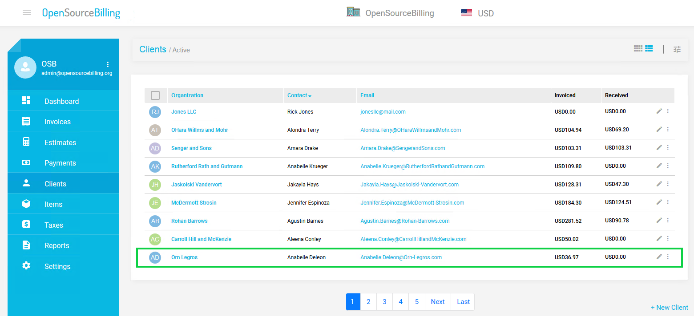
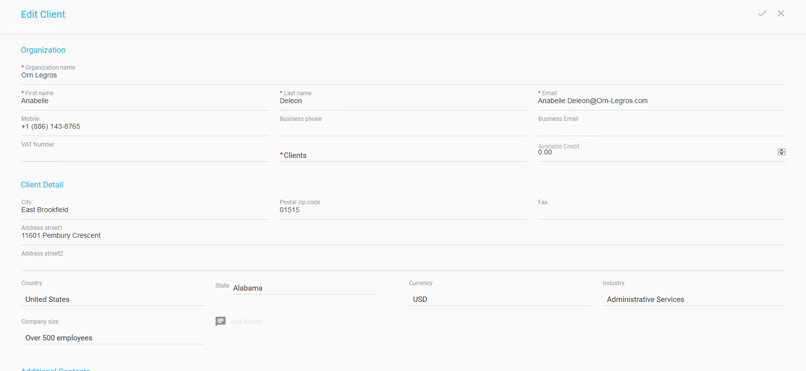
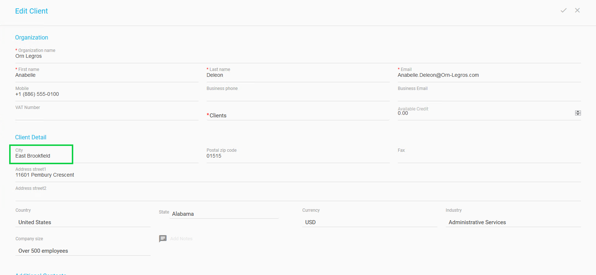
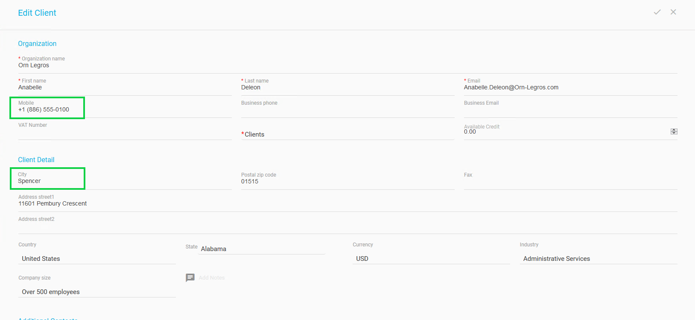

## Change Your Data in the Source Systems

We will now ask you to edit the customer data in one of the simulation source systems in order to demonstrate the seamless automatic synchronization provided by the DPM system. 

We will use Open Source Billing (OSB) for this demonstration. 

Access Open Source Billing (OSB) application. Click the  icon in the **Clients** table that refers to the line showing your customer.

The Edit Client screen displays as result.

Update the **Mobile** number of your customer.

Update the **City** of your customer.

Review your changes to the customer **Mobile** number and **City**.

Click  in the upper-right corner of the screen to save the changes. 

