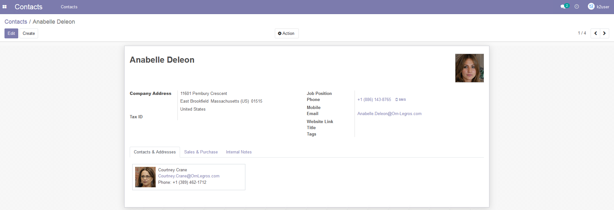
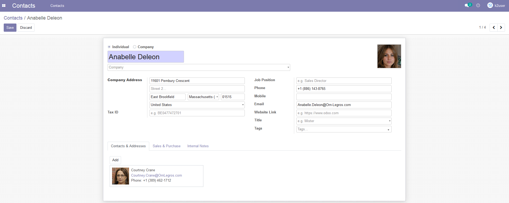
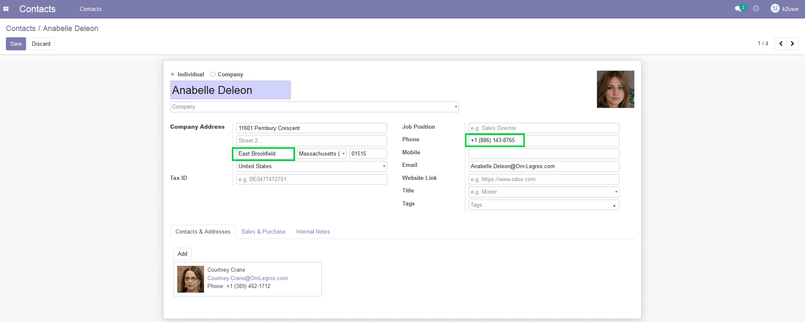
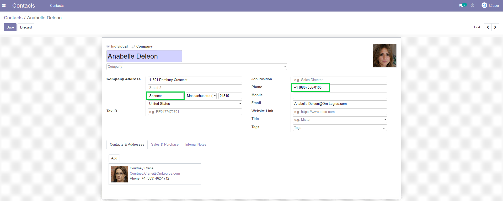

## Change Your Data in the Source Systems

We will now ask you to edit the customer data in one of the simulation source systems in order to demonstrate the seamless automatic synchronization provided by the DPM system. 

We will use Odoo CRM for this demonstration.  Follow the instructions at [Odoo Access and search ](00_Odoo_instructions.md) in order to locate the customer Anabelle Deleon and edit the City and Phone of this customer. 

Click the  icon in the upper left corner of the **Contacts** screen.

The **Edit Client** screen displays as result.

Update the **City** as well as the **Phone** number of your customer.

Verify your changes to the customer **City** and **Phone** number.

Click  in the upper-left corner of the screen to save the changes. 

