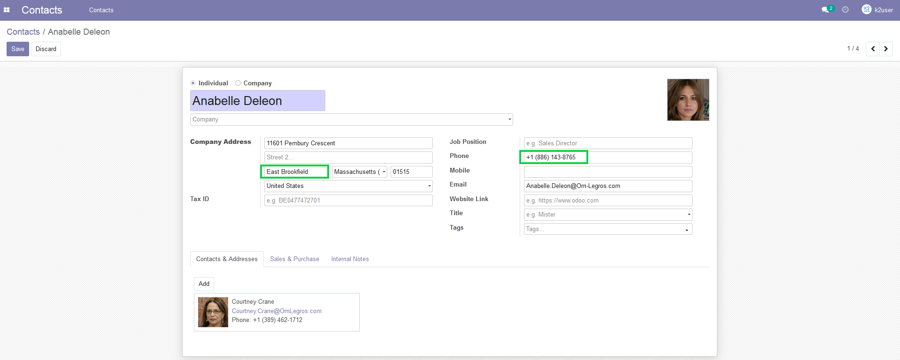
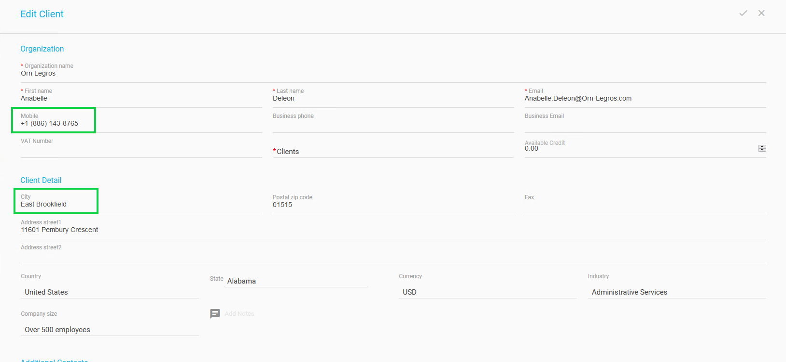

## Preview Your Data in the Source Systems

For this tutorial, preview the data you intend to rectify by accessing the two source systems we set up for simulation purposes. 

[Access Source Systems](../00_Setup/00_Access_Source_Systems.md) provides details on the access to the tutorial "source systems".

Search for the data of Anabelle Deleon and observe the information it contains for the city and phone number in each system. The images below indicate the two fields to observe in each system.

In the Odoo system:

In the OSB system:

