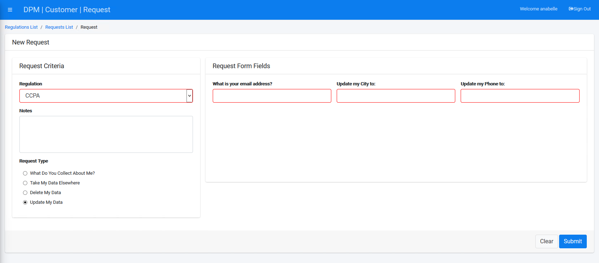

## Submit a Request to Rectify Data

To submit a request to rectify your data, click  under the CUSTOMER menu options, located on the left side of the screen. 

The New Request screen displays.

Select a Regulation from the drop-down list. For this tutorial, we will select **CCPA**.

Select **Update My Data** under the "Request Type" section.

The **Update My Data** Request Type under the **CCPA** Regulation allows you to specify the E-mail to which the request confirmation should be sent, and displays both City and Phone number entry fields to capture the information that should be rectified in the source systems. 

The entry fields that the form displays depend on source systems and any options you designate for the Customer as modifiable data. In our example, we have selected to configure the following fields as editable:

- In the Odoo application: The fields labeled City and Phone.
- In the OSB application: The fields labeled City and Mobile.

Complete the field(s) on the right side of the form with the values you want to be updated for those fields.  

Click  to submit the request to rectify the Customer data.

