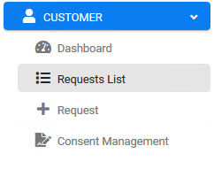
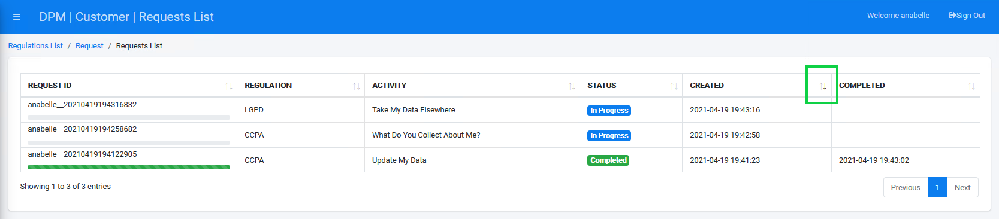
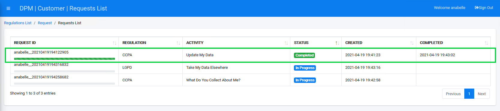

## Ensure Your Request is Marked Complete

After a Customer submits a new request for **Data Rectification**, the next step in the process takes place on the **Requests List** screen. This screen lets the Customer review the case progress while the system automatically updates data based upon rectification policies configured for this activity. The Customer should wait for the activities to be completed, and they can follow that progress on the Requests List screen. When the Request is marked Complete, the Customer data has been successfully rectified in the system.

Click  under the CUSTOMER menu options, located on the left side of the screen. 

     

The Requests List screen displays the progress of a submitted Requests. To more easily and quickly view the one you submitted in the previous tutorial, click the up/down arrows to the right side of the **CREATED** column. This sorts the list by submission time and date, and the most recent should display at or near the top row when sorted by descending order. 

Locate your Request.

**Note**: It may take a few moments for the system to rectify the data. You can follow the progress by viewing the status bar. When the status bar reaches its end and turns fully green, the data rectification is complete.

Click the line of your request to display the Request Details screen containing additional information about your request. 

Click the  button to close the dialog box and return to the Requests List.

