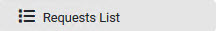
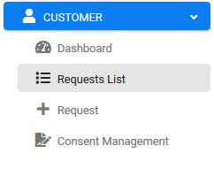

## Ensure Your Request is Marked Complete

After a Customer submits a new request to **Anonymize My Data**, the next step in the data Anonymize process takes place on the **Requests List** screen. This screen lets the Customer review the case progress while the system automatically anonymize data based upon anonymization policies configured for this activity. The Customer should wait for the activities to be completed, and they can follow that progress on the Requests List screen. When the Request is marked Complete, the Customer data has been successfully anonymized in the system.

Click  under the CUSTOMER menu options, located on the left side of the screen. 

     

The Requests List screen displays the progress of a submitted Requests. To more easily and quickly view the one you submitted in the previous tutorial, click the up/down arrows to the right side of the **CREATED** column. This sorts the list by submission time and date, and the most recent should display at or near the top row when sorted by descending order. 

Locate and click your Request.

**Note**: It may take a few moments for the system to mask the data. You can follow the progress by viewing the status bar. When the status bar reaches its end and turns fully green, the data anonymization is complete.

