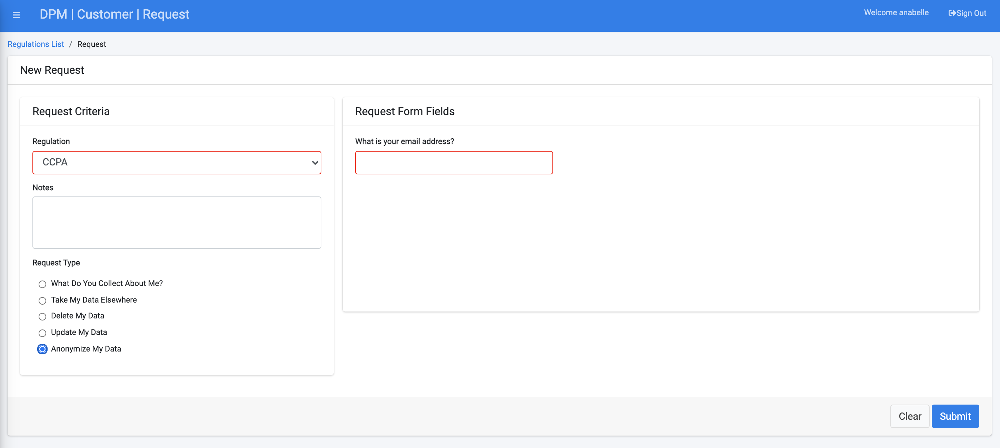

## Submit a Request to Anonymize Data

Click  under the CUSTOMER menu options, located on the left side of the screen. 

The New Request screen displays.

Select the **CCPA** Regulation from the drop-down list and then select **Anonymize My Data** under the "Request Type" section.

Complete the field(s) on the right side of the form. The **Anonymize My Data** Request Type under the **CCPA** Regulation displays only an email address entry field. Enter a valid e-mail address. Confirmation of data masking will be sent to the email address entered into this field.  

Click  to submit the request to anonymize the Customer data.

