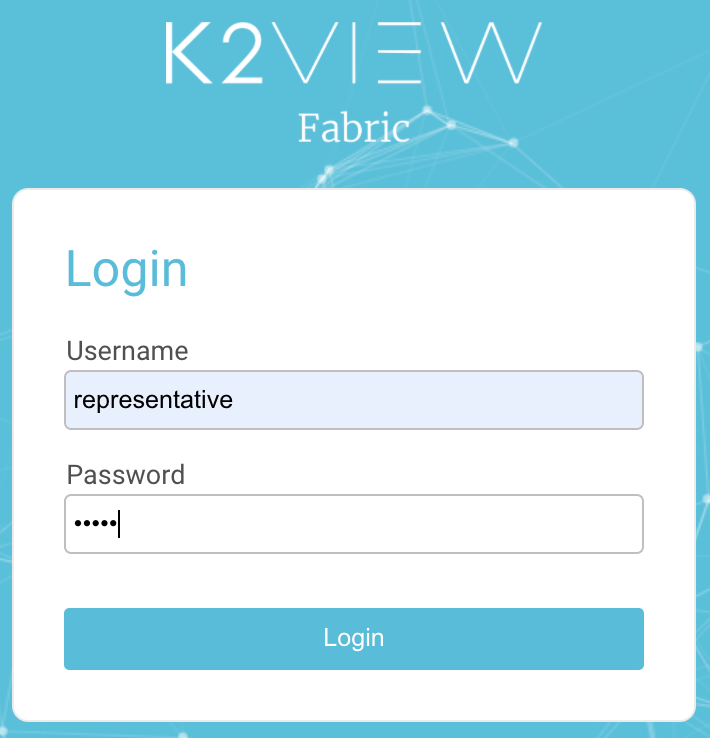
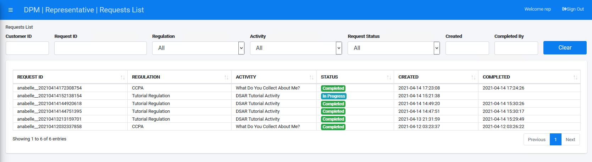

## Login to the System as a Representative

For this tutorial, enter the following credentials to access user information with a Representative role.

**Username** - representative

**Password** - k2view

Click **Login**.

Once a user logs into the DPM system as a Representative, the screen is updated with two frames (windows) of information. The left frame displays a list of menu options for this module. The right frame displays the interactive components of the selection. The Requests List screen displays by default after logging into the system as a Representative.

        

