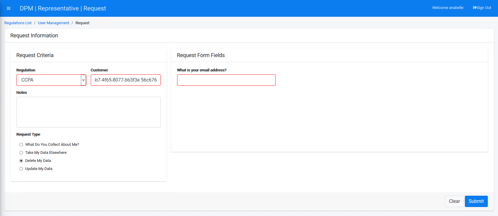
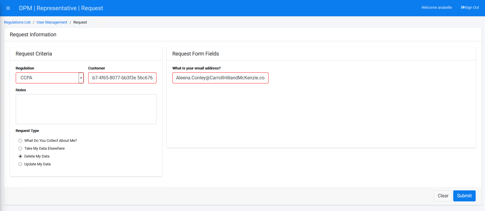

## Submit a Request to Purge Data 

Select a Regulation from the drop-down list. For this tutorial, we will select **CCPA**. Note that the customer identification is already populated as you reached this screen from the search customer option.

Select **Delete My Data** under the "Request Type" section.

Complete the field(s) on the right side of the form. The **Delete My Data** Request Type under the **CCPA** Regulation displays only an email address entry field. Enter a valid email address. Confirmation of data deletion will be sent to the email address entered into this field. 

     

Click  to submit the request to delete the Customer data.

