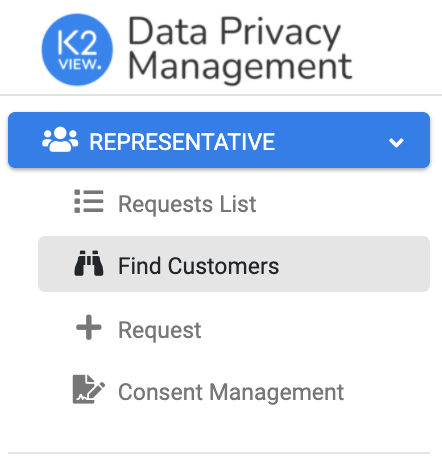
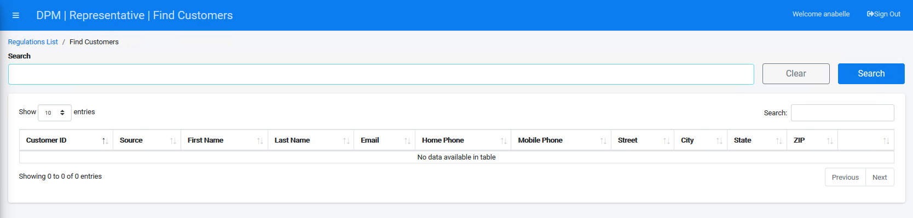
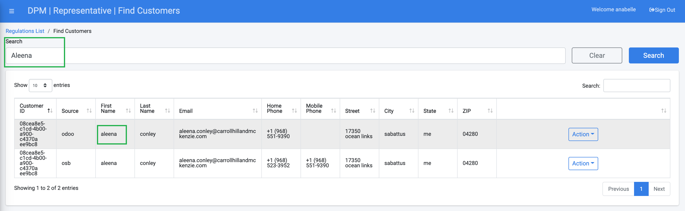
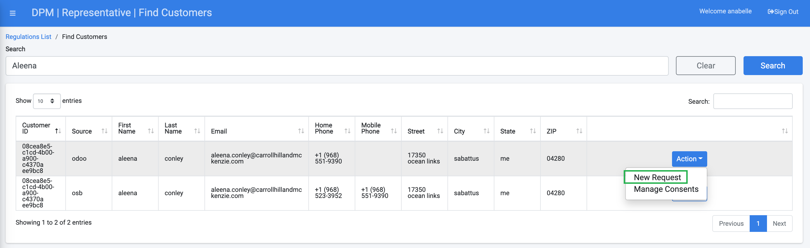

## Search for the Customer to Purge

Before we submit the request to purge the customer data, we should identify the customer in the DPM system. For that we use the representative option to search for a customer. 

Click the **Find Customers** menu option on the left side of the screen. 

 

The Find Customers screen displays.

Enter your search criteria into the "Search" field. Search for the customer by typing the first name at the Search text box. 

Click the  button to execute your search. The results table displays all customers that match the search criteria.

Locate your customer and click the  button on the right-side of their row. 

Select **New Request** to submit a new Request for the customer.

