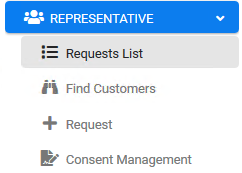
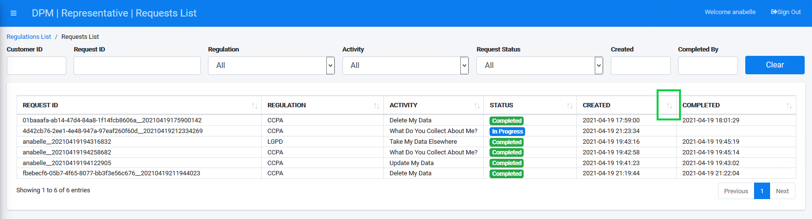
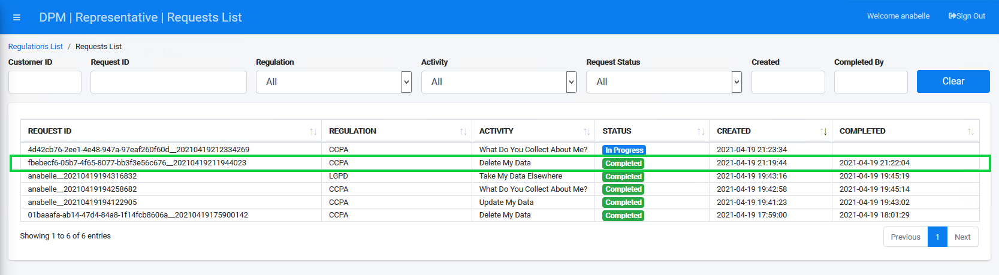
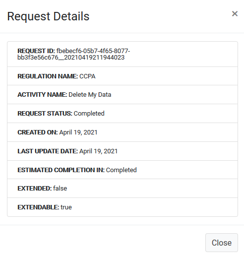
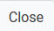

## Ensure Your Request is Marked Complete

After a Customer submits a new request to **Delete My Data**, the next step in the data purging process takes place on the **Requests List** screen. This screen lets the representative review the case progress while the system automatically deletes data based upon deletion policies configured for this activity. The representative should wait for the activities to be completed, and they can follow that progress on the Requests List screen. When the Request is marked Complete, the Customer data has been successfully purged from the system.

Click  under the REPRESENTATIVE menu options, located on the left side of the screen. 

     

The Requests List screen displays the progress of a submitted Requests. To more easily and quickly view the one you submitted in the previous step, click the up/down arrows to the right side of the **CREATED** column. This sorts the list by submission time and date, and the most recent should display at or near the top row when sorted by descending order. 

Locate and click your Request.

**Note**: It may take a few minutes for the system to purge the data. You can follow the progress by viewing the status bar. When the status bar reaches its end and turns fully green, the data purge is complete.

The Request Details dialog box displays. 

Click the  button to close the dialog box and return to the Requests List.

