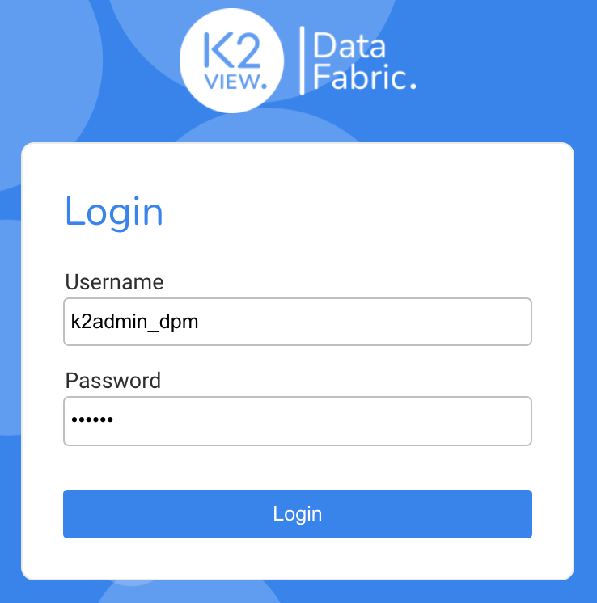
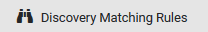
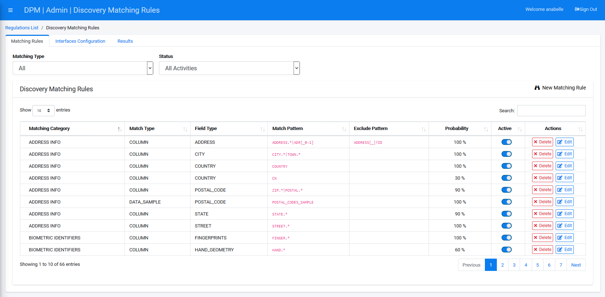

### Login to the System

To configure the Discovery Rules, you should enter the DPM using the credentials of a User that has the Admin priviliges. 

For this tutorial, enter the following credentials to access user information with an Administrator role.

**Username** - k2admin_dpm

**Password** - admin

This user is defined as an Administrator user. 

Click **Login**. 

Click  under the ADMIN menu options, located on the left side of the screen. 

The Discovery Matching Rules screen displays.

The Discovery screen is composed of three tabs: Matching Rules, Interface Configuration, and Results. 

- **Matching Rules** tab is where the rules that govern the discovery process are defined. You can see that the DPM already includes a set of built-in discovery rules covering the discovery of many of the common PII data fields. New rules can be added by configuration as described in the next steps of this tutorial.
- **Interfaces Configuration** tab is where the databases on which the discovery process should be executed are defined. It is also in this tab where requests for this process execution are launched. 
- **Results** tab presents the results of the discovery process. Here, the user can review the list of fields that the discovery processes has flagged as probably containing PII data.  

In the following steps, we will guide you through the configuration of new discovery rule, definitions of the interfaces, launching a discovery process, and the review of the results.

