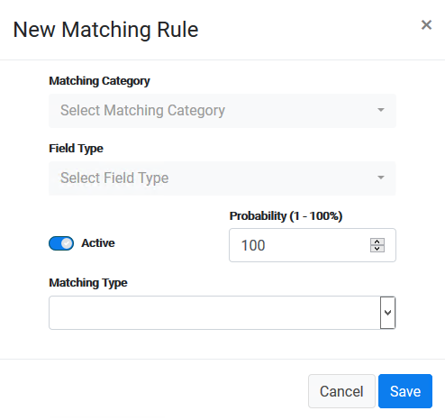

## First Tab: Matching Rules

The first tab of the Discovery configuration presents the list of discovery rules that are already configured, and allows the user to configure additional rules. 

Each line in the table is a rule, represesnting a specific validation that evaluates if a field may contain PII data.  

When launching the discovery process, the system inspects each field in the databases that are scanned and compare the column name or the content of the field with each one of the rules. 

### To configure a new rule:

In the first tab of the Discovery screen, click the  button at the top-right of this tab in order to configure a new matching rule. 

The New Matching Rule dialog box displays. 

Before guiding you through the creation of new discovery rules, we will describe the different types of rules that can be created. Those types are defined by the **Matching Type** field. 

There are four Matching Types: Column, Data, Data Function, and Data Sample. Each of these types allow you to configure the process to search PII fields in the database based on different aspects.

[Column Matching Type](03_03_02_Discovery_NewMatchingRule_Column.md)

The Column Matching Type lets you configure rules that inspect the column names in the databases that are scanned, and then compare them with an expression you define in the Match Pattern field. Using this option, you can identify if the column contains PII data based on the column name.

[Data Matching Type](03_03_03_Discovery_NewMatchingRule_Data.md)

The Data Matching Type lets you narrow your view to the data itself under each column. This rule compares data in the database for each column using a set of predefined values.

[Data Function Matching Type](03_03_04_Discovery_NewMatchingRule_DataFunction.md)

The Data Function Matching Type lets you run a function on the content of a sample population from a table. The function logic is used to predict if the content of the column is likely to be PII data.

[Data Sample Matching Type](03_03_05_Discovery_NewMatchingRule_DataSample.md)

The Data Sample Matching Type lets you compare the column content with a set of sample data that were previously loaded into a reference table.

