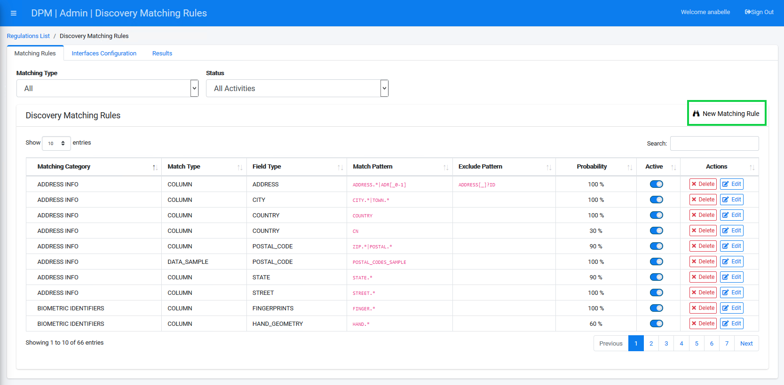

### Create a New Matching Rule - Column Type

In this example, we will describe how to configure a matching rule that inspects the column names in the database in order to identify which fields might contain PII data. The specific rule we will configure in this example is one that looks for column containing a social security number. This is a rule that already exists in the built-in rules of the discovery functionality, and the description below is used only for the purpose of exemplifying this option.

Click the  button at the top-right of the screen in order to configure a new matching rule. 

The New Matching Rule dialog box displays. 

Select a **Matching** **Category**. Categories are used for grouping Matching Rule topics. This field lets the user classify the new rule under an existing Category, or select **New Category** to manually enter a new one. In the image below, we chose "Contact Info", but you can use any category name.

In the **Field Type** we specify the nature of the field we are seeking. It can be one of the built-in options or a new type. We selected **SOCIAL_SECURITY_NUMBER**. 

Set the **Probability** percentage of the New Matching Rule. This describes the level of confidence you attribute to the finding of the discovery process for a field that matches the rule. For this tutorial, we will set the Probability to **80**%. 

Select the **Matching Type**. Since we want to demonstrate the discovery based on a column name, we will select a **Column** Matching Type. 

After you select a Matching Type, additional entry fields will display depending upon your selection. When you chose the **Column** matching type, the fields that display are  **Match Pattern** and **Exclude Pattern**.

The **Match Pattern** defines the pattern of the column name for which you are searching. You can type any valid Regular expression (RegEx) in this field. 
The **Exclude Pattern** defines the pattern that you would like to ignore. The discovery process results list all the columns that both matched the **Include Pattern** and didn't match the **Exclude Pattern**.

Enter a **Match Pattern**.

Review your entries as needed, and then click .

The New Matching Rule displays in the Matching Rules table. If your table contains entries that span across multiple screen pages, you can distill the results by selecting the relevant Matching Type, or by using the Search option at the upper-right side of the table.

The New Matching Rule displays in the table.

