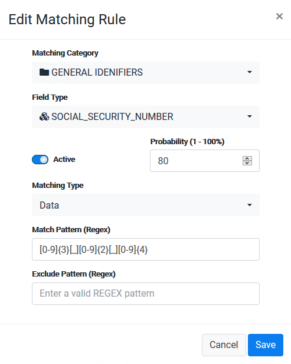

### Create a New Matching Rule - Data Type

Creating a discovery rule based on the **Data** type is done by following the same steps as for the **Column** type we previously demonstrated. The difference between them is: when you select the Data **Matching Type** to be **Data** then the **Include pattern** and **Exclude pattern** refer to the content of the field and not to the column name. 

For example, in the Rule described below, the system will evaluate, for every field it inspects, whether the content of the field meets the regular expression desccribed in the **Include Pattern** definition. 

In this case the expression describes a 9-digit number composed of three blocks in the length of 3, 2 and 4. As this may not apply only for a social security number, you may want to attribute a lower probability to this rule, compared with the rule that verified whether the column name is "SOCIAL_SECURITY_NUMBER".

