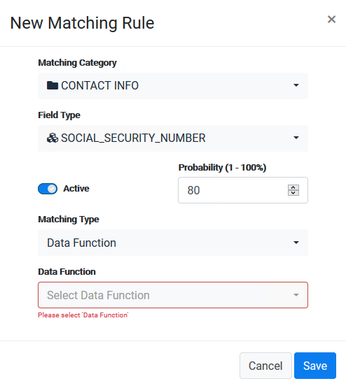
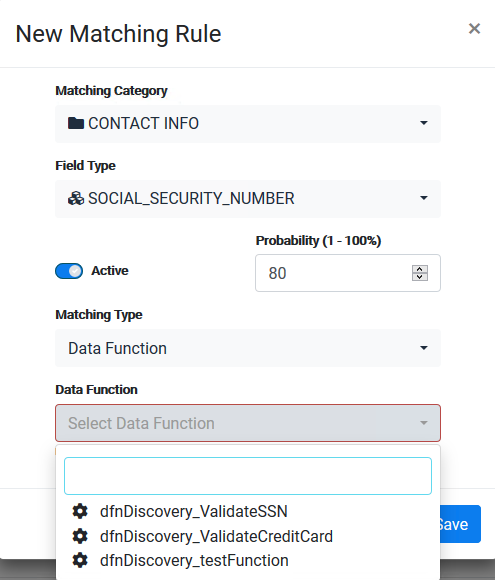

### Create a New Matching Rule - Data Function Type

The **Data Function** matching type lets you indicate a function that should be executed for each field that the discovery process evaluates.

It is defined in the same way as the previous matching types. When you select the matching type to be **Data function**, the list of available functions is presented in the dropdown.

Create a new rule and select the **Matching Type** to be **Data Function**. 

Select a **Data Function** from the dropdown list. for our example, we selected the built-in dfnDiscovery_ValidateSSN function.

You can add any function as part of your project implementation, in accordance with the validations you would like to execute. 

