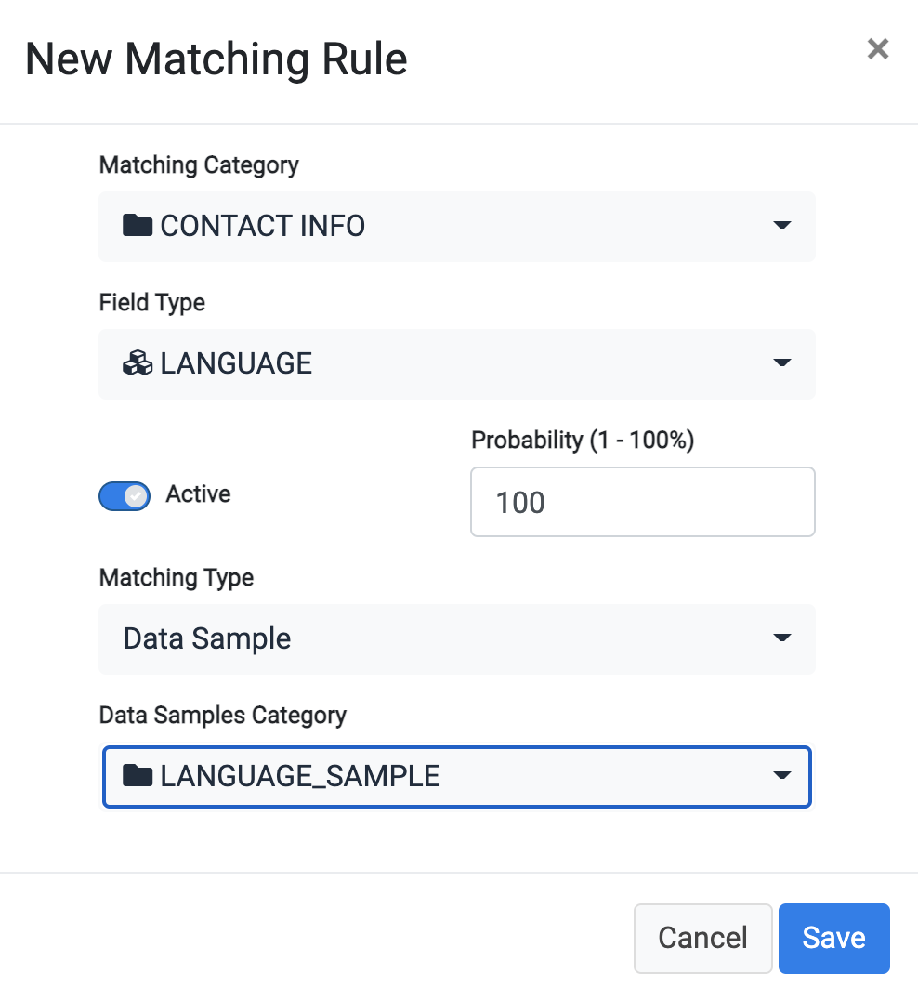

### Create a New Matching Rule - Data Sample Type

The **Data Sample** matching type is used when the discovery of PII data should be based on a long list of optional values. For example, if you want to find fields wthat hold the information of the preferred language of a customer, you can ask the discovery process to compare the information in each field with a list of possible languages that you loaded into a reference table. 

In this matching type, a table with all the optional values is created and is provided as input to the matching process.

Create a new matching rule setting the **Match type** to be **Data Sample**. 

Select a **Data Samples Category** from the dropdown list. For this tutorial, select **LANGUAGE_SAMPLE**.

You can define and load any set of such reference tables as part of your project.

