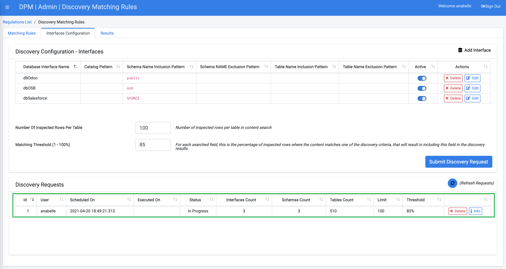

### Submit a Discovery Request

When you Submit a Discovery Request, the system will check which Interfaces have been listed and are marked as Active. On each of the active interfaces, it will run all the matching rules that were defined in the first tab.

Click the  button, located in the lower-right of the Interfaces Configuration screen. The request you submitted will display under the Discovery Requests section, located along the bottom of the Interfaces Configuration tab.

**Note**: Click  to refresh the list of results that display under the Discovery Requests table. It may take a few minutes for the DPM system to return your results, and that time may vary based upon the parameters you entered prior to initiating the data discovery.

