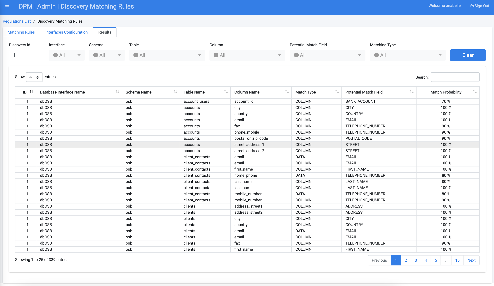

## Third Tab: View Discovery Results

After the DPM system has searched the databases of all selected systems for PII data, you can search within the Discovery Results at a detailed level. The Results tab displays these details, letting you narrow down the list by a number of filters. You can manage the Results List view in a variety of ways using the drop-down lists along the top of the screen. 

Each of the lines in the results table indicates a field in one of the source databases that was identifyed as potentially holding PII data. The system indicates the system, table and field name, along with the matching type and the nature of the field (e.g. First name or Bank account number) that resulted in this identification. 

Click the Results tab:  

For additional information about the Results tab, refer to the DPM User Guide [Navigating the Results Tab](/articles/DPM/02_Admin_Module/15_9_Discovery_Navigating_Results_Tab.md).

[
 Return to Tutorial topics
](../README.md#data-subject-requests)
