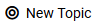
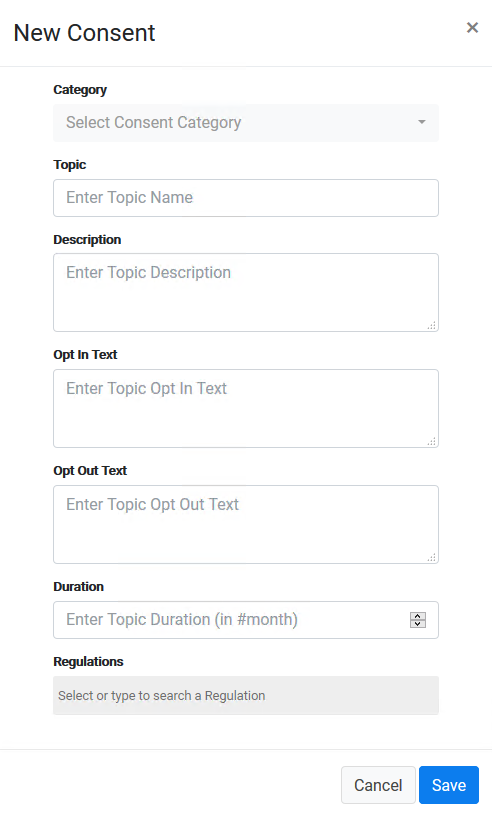
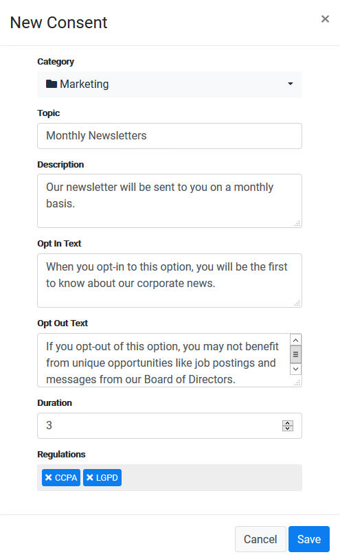
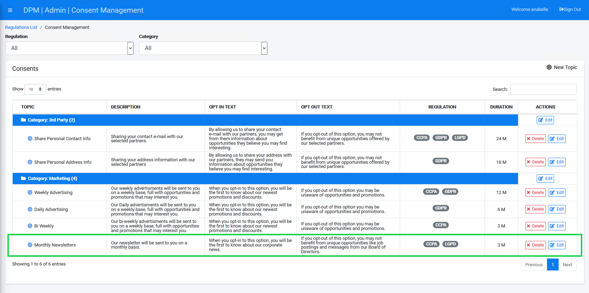

### Create a New Consent

The first step in consent management is to configure what are the consent topics that should be obtained from your customers.

To configure a new Consent Topic, click the  button at the top-right of the Consent Management screen. 

The New Consent dialog box displays.

     

In the New Consent Topic popup, populate the following fields:

1. Select a **Category**. Categories are used for grouping consent topics. This field lets the user classify the new consent under an existing Category or select **New Category** to configure a new one. For this demonstration, select **Marketing**. 
2. Enter the **Topic** name.     
3. Enter the new consent Topic **Description**.    
4. Enter the **Opt-In Text**. This is the text that displays to the customer, explaining the benefits of opting in to this consent.     
5. Enter the **Opt-Out Text**. This is the text that displays to the customer if they decline their consent. It could explain how they may be impacted by opting-out, as well beneficial information that they won’t see as a result.      
6. in the **Filter List** field you can choose one of the existing Custom List as the base for the filter that will be used for this consent. This will allow you to restrict this consent so that it appears only for customers that meet the criteria of specific user categories. You may also create a new list by accessing the [Custom List](/articles/DPM/02_Admin_Module/16_Custom_Lists.md) menu option. 
7. If you have selected a Filter List in the field above, you can now use the **Filter Items** field to specify the values from this list that are relevant for this consent. For example, we selected the Filter List to be the "Customer Type" list, and specified that this consent is relevant for Postpaid and Broadband customers. 
8. Define the list of **Regulations** that this consent is linked to by selecting the relevant regulations from the dropdown list. The list of regulations that displays in this dropdown is defined in the Regulation List option on the Admin menu. Multiple regulations can be selected. For this example, we selected the “CCPA” and “GDPR” Regulations.
9. Define the **Duration** that the consent is considered valid at the customer level. For every customer, the consent takes effect the moment of opting-in, and then for the duration that is specified in this field. The number you enter represents the number of months the consent is valid. In this example, we entered “24” to represent 24 months. 
10. Set the **Mandatory** indicator to **off** if the user is allowed to switch this consent on and off. 

    

Review your entries as needed, and then click .

The New Consent displays in the Consents table. The rows are separated by Category. Since we chose “Marketing” Category in the New Consent, it displays under the Marketing Category, along with all other Consents of the same Category.

     

Click , located at the top-right corner of the screen.

[
 Return to Consent Tutorial
](01_Consent_Main.md)
