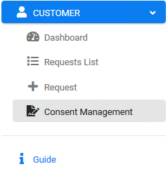
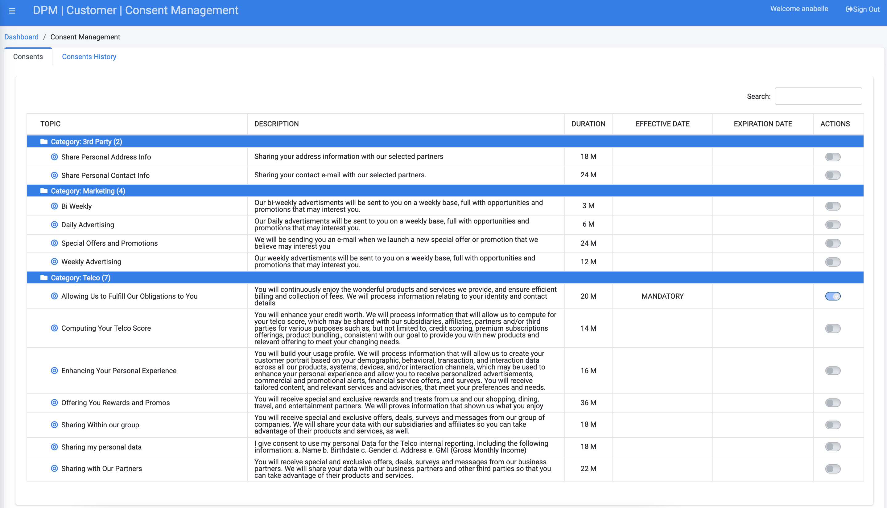

### Login to the System as a Customer

To manage your consent preferences as a customer, enter your DPM application **Username** and **Password**.

**Username** - anabelle 

**Password** - k2view

                                

Click **Login**.

Once you are logged in, the Customer Landing screen is displayed. In order to reach the consent management screen from the Customer landing page, Click  under the CUSTOMER menu options, located on the left side of the screen. 

     

The Consent Management screen displays, showing the current customer consent preferences.

      

