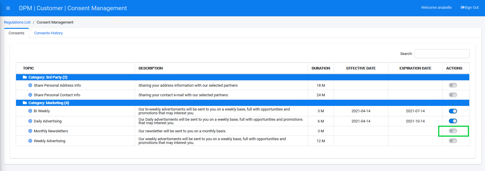
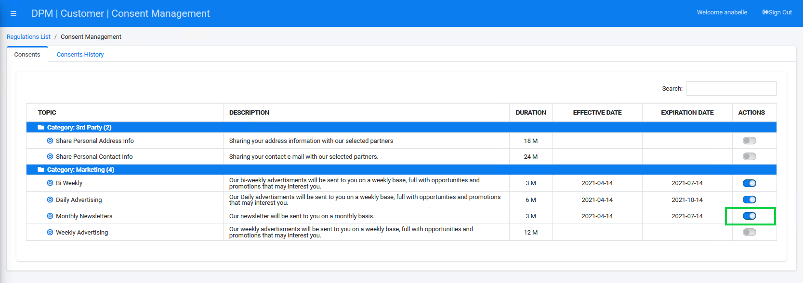

### Opt-In or Opt-Out of Consents

**Opt-In to a Consent**

Locate a Consent in the Consents table. Under the ACTIONS column, turn the On/Off slider to On to opt-in to the selected Consent.

  

A dialog box displays, verifying that you want to turn on the consent. The text in this dialog box is the text that the administrator had defined when configuring this consent topic.

                                   

Click  to turn on the consent. 

The On/Off slider is turned to “On”. The EFFECTIVE DATE is set to the current date and the EXPIRATION DATE is defined according to the consent configured duration. 

**Opt-Out of a Consent**

To opt-out of a Consent, locate a Consent in the Consents table. Under the ACTIONS column, turn the On/Off slider to Off to opt-out to the selected Consent.

A dialog box displays, verifying that you want to turn off the consent.

Click  to turn off the consent. 

The On/Off slider is turned to “Off”. 

 

The action is registered in the Consent History tab, as detailed in the next section. 

