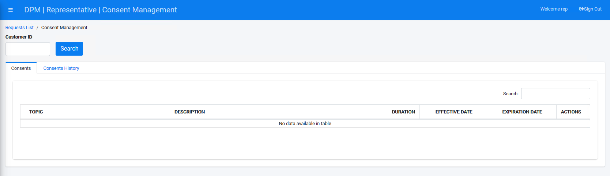
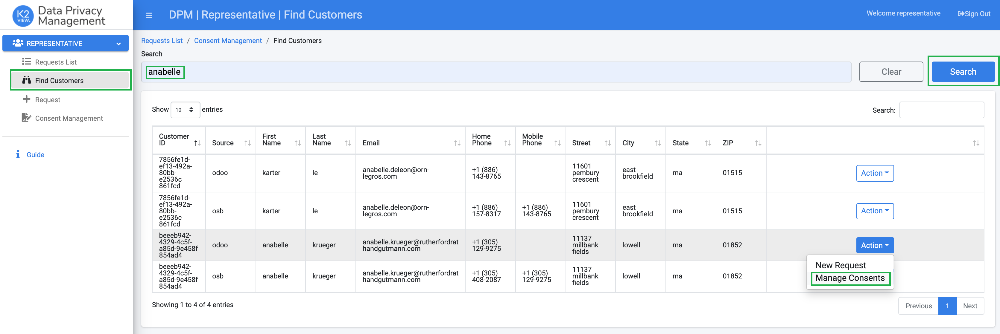

### Login to the System

Enter the DPM application using a user that has Representative credentials.

For the purpose of the tutorial we have created a user called "representative".

                         

Click **Login**.

Once a user logs into the DPM system as a Representative, the system provides two options to reach the consent information of a specific customer: 

If the customer number is known, select the "Consent Management" menu option, enter the customer number in the search box and click Search. 

     

If the customer number is unknown, use the "Find Customers" menu option and search for the customer. Once the customer was found, click the Action dropdown on the right side of the customer record, and select the "Manage Consents" options.

  

