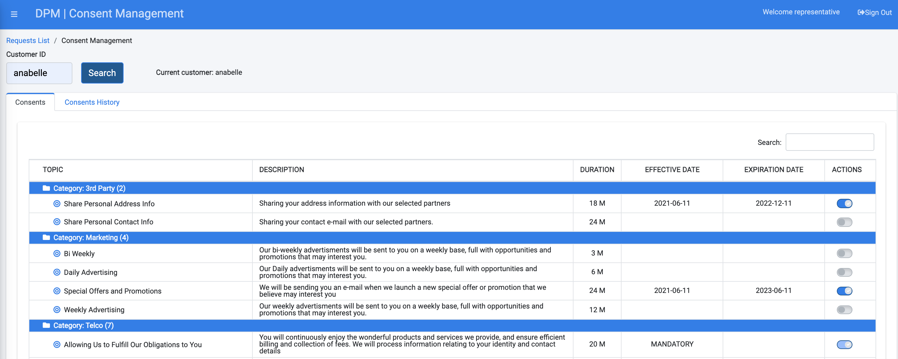

### View the Consents List

The Consent Management functionality at the Representative level is equal to the functionality at the Customer level with the only difference: The Representative must enter the customer identification in order to retrieve the information. To view the Consents list of a customer, you need to search for them based on their Customer ID.

Enter the **Customer ID**.

                                   

Click the  button. The customer Consents list displays.

  

