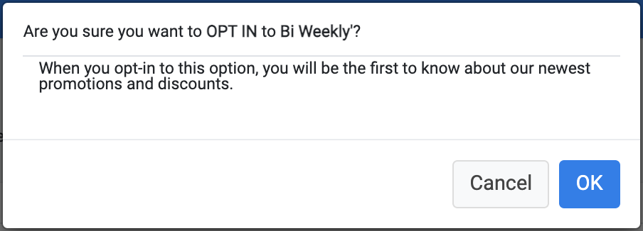
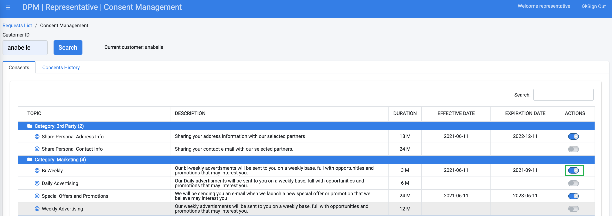
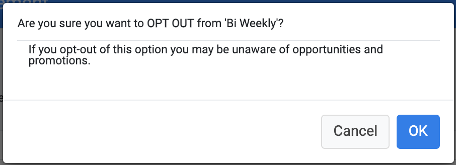

### Opt-In or Opt-Out of Consents

**Opt-In to a Consent**

Locate a Consent in the Consents table. Under the ACTIONS column, turn the On/Off slider to On to opt-in to the selected Consent.

  

A dialog box displays, verifying that you want to turn on the consent.

                                   

Click  to turn on the consent. 

The On/Off slider is turned to “On”.

  

**Opt-Out of a Consent**

To opt-out of a Consent, locate a Consent in the Consents table. Under the ACTIONS column, turn the On/Off slider to Off to opt-out to the selected Consent.

A dialog box displays, verifying that you want to turn off the consent.

 

Click  to turn off the consent. 

The On/Off slider is turned to “Off”.

