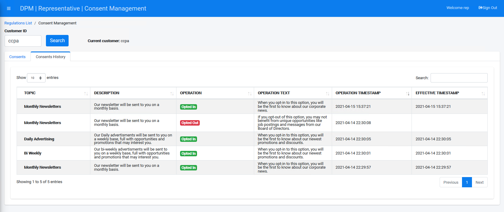

### View and Search the Consent History

Any change that the Representative performed in the consent preferences (example: opt-in or opt-out) is registered in the system for audit purposes. The change can be viewed and filtered in the **Consents History** tab.

**View Consent History**

Click the **Consents History** tab. 

                                

The Consents History screens displays.

**Search for Consents**

To search a specific consent, use the "Search" option at the top-right of the Consents History table.

### Logout of the System

Click , located at the top-right corner of the screen.

[
 Return to Tutorial topics
](../DPM_Application_Tutorial.md#data-subject-requests)
