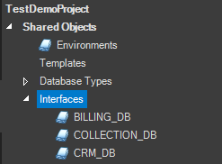
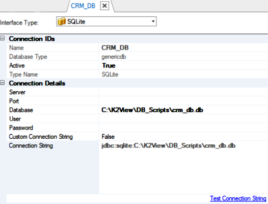

# FABRIC DEMO PROJECT 

The Fabric Knowledge Base project includes a set of Logical Units, code examples and objects that are used in all Knowledge Base articles and Learning Items. It uses four SQLite databases as the data source. 

Follow the steps below to set up the demo project on your local Fabric.

## Setup Steps

To set up the project and connect the databases, do the following:

1. Open the Fabric Studio and create a new project.

2. Download the [KB_FABRIC_PROJECT.k2export](KB_FABRIC_PROJECT.k2export) file and import it to your project as follows:

    

3. Download the [BILLING_DB.db](Demo_sources/billing_db.db), [CRM_DB.db](Demo_sources/crm_db.db), [COLLECTION_DB.db](Demo_sources/collection_db.db) and [ORDERS_DB.db](Demo_sources/orders_db.db) files locally on your computer. Note the location where you placed these files. 

4. Edit the CRM_DB, BILLING_DB, COLLECTION_DB and ORDERS_DB Interfaces, as follows:
    - Double-click to open the Interfaces from the Project tree.

      
    
    - Edit the **Database** field, setting the location of the *.db file to the location where you placed these files.
    
       
    
    - Test the connection by clicking on Test Connection String link.
    
    - Save the changes and close the DB interface.
    
    [Click for more information about DB Connection Settings](/articles/05_DB_interfaces/03_DB_interfaces_overview.md).

