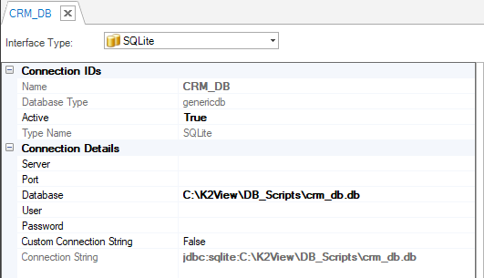
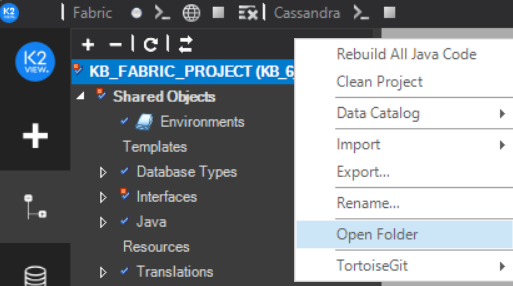
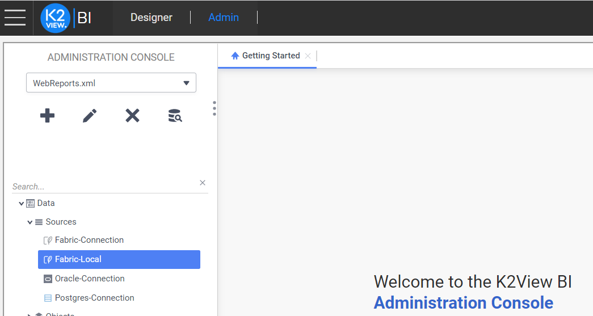
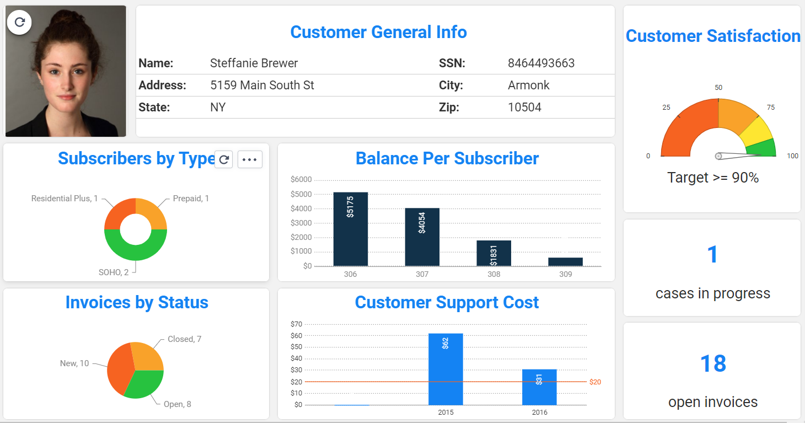

# FABRIC DEMO PROJECT 

The Fabric Knowledge Base project includes a set of Logical Units, code examples and objects that are used in all Knowledge Base articles and Learning Items. It uses four SQLite databases as the data source. Follow the below steps to setup the demo project on your local Fabric.

## Setup Steps

To setup the project and connect the databases, do the following:

1. Open the Fabric Studio and create a new project.

2. Download the [KB_FABRIC_PROJECT.k2export](KB_FABRIC_PROJECT.k2export) file and import it to your project as follows:

    

3. Download the [BILLING_DB.db](SqliteDB/billing_db.db), [CRM_DB.db](SqliteDB/crm_db.db), [COLLECTION_DB.db](SqliteDB/collection_db.db) and [ORDERS_DB.db](SqliteDB/orders_db.db) files locally on your computer.

4. Edit the CRM_DB, BILLING_DB, COLLECTION_DB and ORDERS_DB Interfaces, as follows:
    - Open the Interfaces from the Project tree.

      

    - Edit the **Database** field, setting the location of the *.db file to the local directory.

      

    - Test the connection by clicking on Test Connection String link. 

    - Save the changes and close the DB interface.

    [Click for more information about DB Connection Settings](/articles/05_DB_interfaces/03_DB_interfaces_overview.md).

## BI Configuration and Setup

If you are already using the demo project from the previous versions, you need to download the project export as well as the DB files again.

To setup the BI and generate the example reports and dashboards using the demo project, do the following steps:

1. Install the docker image as explained [here](/articles/38_bi_integration/01_Installation.md).

2. Download the [WebReports.XML](SqliteDB/WebReports.xml), [reports.json](SqliteDB/reports.json) and [Json.zip](SqliteDB/Json.zip) files locally on your computer.

3. TBD - run the script that will update your docker image with the Demo Project BI example.

4. Open the Demo Project in the Fabric Studio and open the project's config.ini as follows:

   * Right click on the Project and click **Open Folder**:

     

   * Then go to **FabricHome/config** and open the **config.ini**.

   * In the project's config.ini make sure that the **BI_PORT** the **[bi]** section is set to **localhost**, the Storage Management DB is pointing to the default SQLite DB and the **TABLE_PREFIX** is empty.

5. Deploy the project including the References. 

6. Click the icon to open the **Web Framework > BI** and go to **Admin** tab.

   

7. Go to **Data > Sources > Fabric-Local**, click the  icon to see the Connection String and update the URLS to your computer's IP. 

   

   * Click the  icon to test the connection.
   * If the connection is successful, click **Apply** to save your changes.

## How to Work with BI Demo

1. Switch to the **Designer** tab of the **BI** and open the **Demo Proj** folder. The folder includes a dashboard called **Dashbrd-v0** and a list of reports which construct this dashboard.

2. Double click to open the dashboard in Edit mode or click the  icon to generate the dashboard with the data. 

3. The generated dashboard is built using a data of a customer_id = 118 from the Customer LU of the demo project. 

   

4. To see the data of another customer, go to **Admin** tab and open **Data > Parameters > customer_id**, set another value and click **Apply** to save your changes. Then return to the **Designer** tab, open the dashboard and play it.