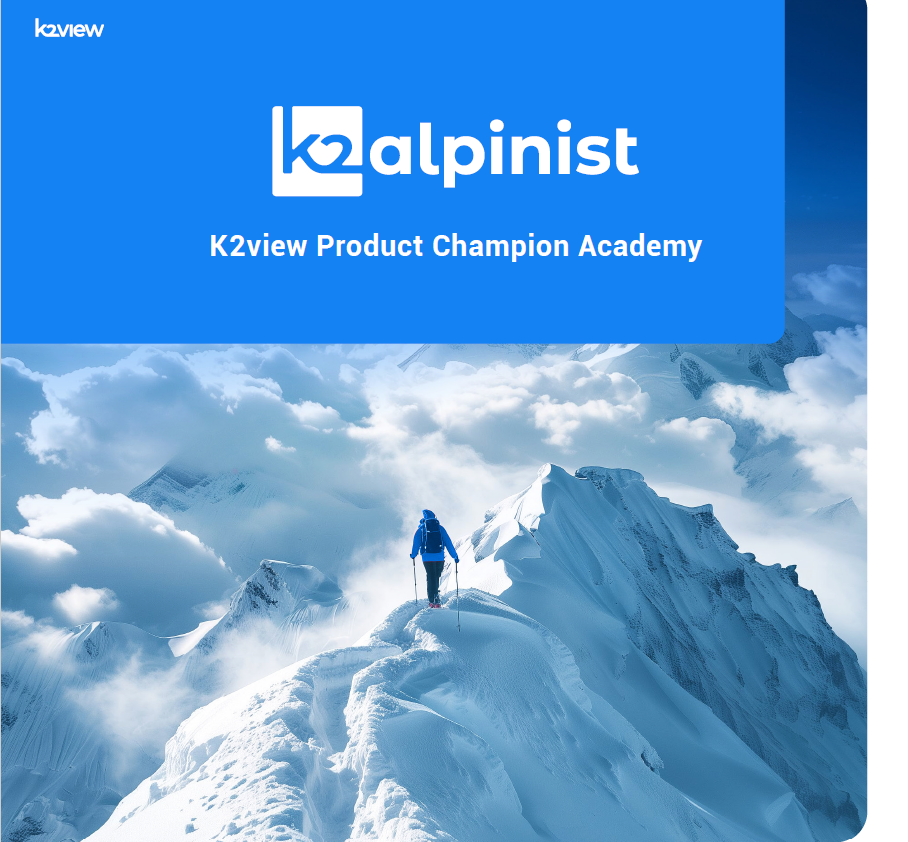
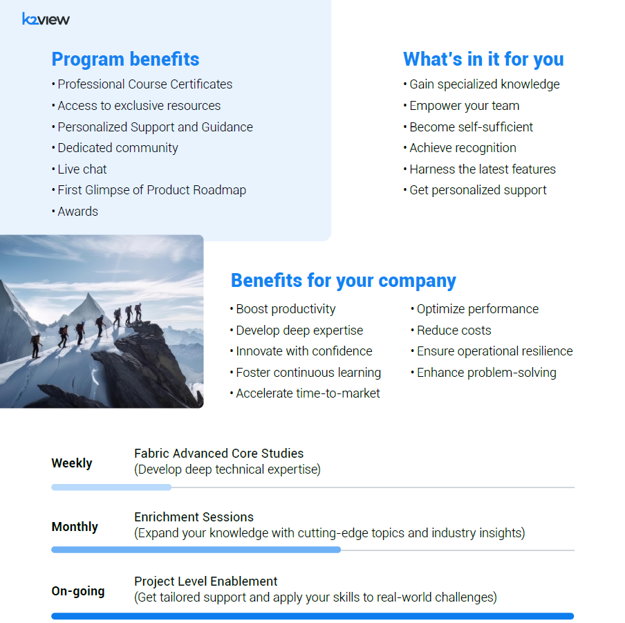

# K2view Product Champion Academy

K2view Product Champion Academy equips its members with
in-depth technical expertise and best practices to successfully
lead the implementation of K2view and supporting tech stack
(Kafka, Cassandra, Elasticsearch, CDC, etc.).

**Gain the product knowledge to deliver strategic business value**
**through optimized data-driven solutions, while minimizing**
**your reliance on external resources.**

## Prerequisites for success

To ensure your success in the K2view Fabric Leadership Academy, the following prerequisites
are required:

**Foundational knowledge**: Completion of all Fabric online courses.

**Hands-on experience**: Minimum 6 months of experience working on a K2view Fabric project.

**Skill assessment**: Successful completion of an online test demonstrating:

- Solid understanding of Fabric architecture and components.
- Ability to implement and troubleshoot Fabric solutions.

**K2view approval**: Confirmation of suitability by K2view.