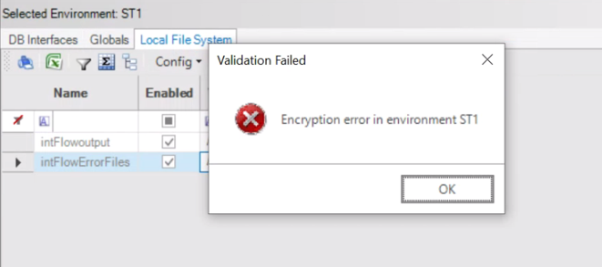

### [Multiple GETs and Release Statement](https://github.com/k2view-academy/K2View-Academy/issues/270)

#### Question:

Why is there a note in the help section of Release statement saying the following:

*Important:
When there is a use case of multiple get in a loop on the same fabric session, it is recommended to use the release (without lu name) command after each loop iteration.*

#### Answer:

It is recommended to use the Release command without the LU name only if you need to release the LUIs of all LUs in the session. If you need to release an LUI of a specific LU, you need to set the LU name in the release command.

### [Encryption error in environment <env_name>](https://github.com/k2view-academy/K2View-Academy/issues/264)

#### Question:

When trying to save the Environments file from Studio, we sometimes get the error saying "Encryption error in environment <env_name>".

We were able to resolve it by "Re-keying" for that environment. The question I have is why do we get this error? What's the reason behind this behavior?

#### Answer:

We assume that on those cases you use "Fabric URL" option at the environment definitions and you switched from one to another, or you just start using "Fabric URL". In such cases re-key is required. Please read more [here](https://support.k2view.com/Academy_6.5/articles/26_fabric_security/04_fabric_interfaces_security.html).

### [Fabric versions supporting TDM7](https://github.com/k2view-academy/K2View-Academy/issues/248)

#### Question:

In the past, we had a hard dependency on specific fabric version say fabric version 5.3 for TDM version 5.1, is it still the case with TDM7?
TDM7 release notes mention fabric 6.4.1 but now 6.4.2 is available, wondering if its ok to go ahead with latest fabric versions TDM projects.

#### Answer:

You can run TDM 7.0.1 either on Fabric 6.4.1 or Fabric 6.4.2.

TDM 7.1 is based on Fabric 6.5.

