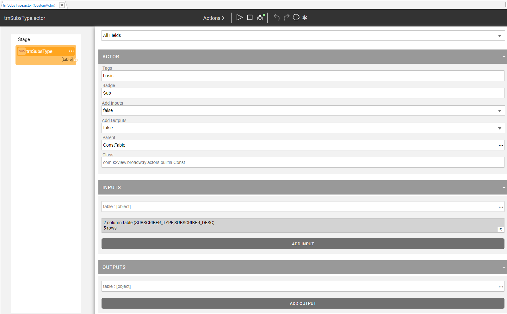

### Broadway's Actor Editor

Broadway offers a number of built-in Actors addressing a wide range of predefined activities that may be added to Broadway flows. Examples for such activities are: reading a file and writing into a file, creating a table and populating it, parsing an object or concatenating a string, publishing messages to a queue or invoking a Web service.

If and when your implementation requires a business logic that is not supported by a built-in Actor and which is repeated across several flows, you can create an Actor using an **Actor Editor** by one of the following: 

* Inheritance from the existing product Actors, or
* Building an Actor based on your Java class.

The **Actor Editor** allows you to:

* Create an Actor, and define its inputs and outputs.
* Set the inputs and outputs as final or hidden, if required.
* Set the default values of the inputs and outputs, if required.
* Run the Actor in order to debug it.

[Click to learn more about the Actor Editor](https://support.k2view.com/Academy_6.5/articles/19_Broadway/28_actor_editor.html).

