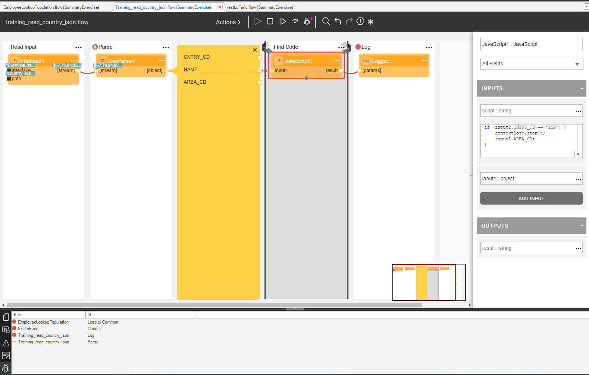

### Fabric Studio Breakpoints

Fabric Studio provides an ability to view all active breakpoints. 

A new panel was added to the “Server / Activity Logs” area, which displays a list of the breakpoints in the open Fabric objects (currently only Broadway flows are supported), including the File name (flow name) and the ID (e.g. stage where the breakpoint is set).

The panel is refreshed every 1 sec, but only when the panel is open (visible to the user). The yellow arrow sign on the panel indicates the breakpoint where the flow currently stopped. Double-click on the breakpoint description in the panel brings the related flow to the front. 

[Click to learn more about the Studio Breakpoints](https://support.k2view.com/Academy_6.5/articles/13_LUDB_viewer_and_studio_debug_capabilities/04_breakpoints_panel.html).

