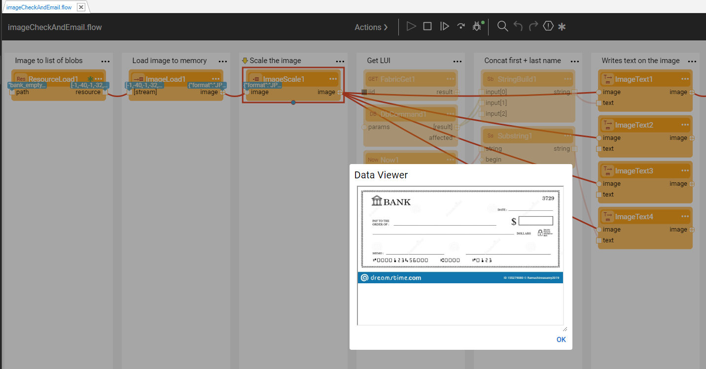
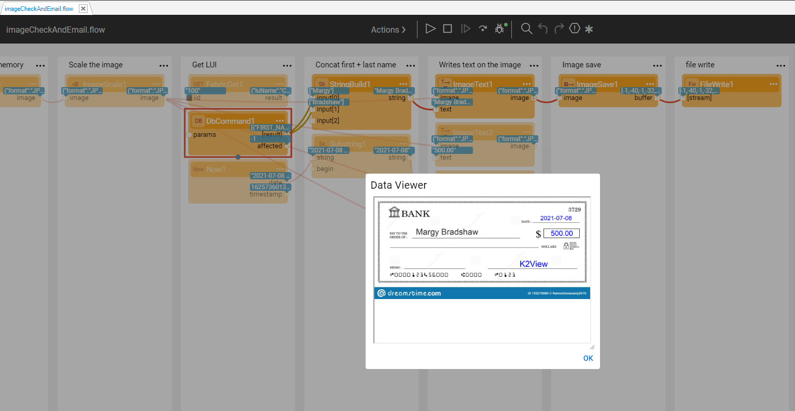

### Image Manipulation Actors

Fabric provides a set of built-in image manipulation Actors that allow to perform various activities, such as:

- Load an image into a flow.
- Write a text on a given image.
- Clone an image in memory.

The Actors are:

* **ImageLoad** - receives a buffer or buffer stream, and loads the image into memory.
* **ImageSave** - encodes the image to a byte buffer with the given format. This can then be transported or saved using DbLoad, FileWrite, Http or other Actors.
* **ImageText**, **ImageScale**, **ImageDuplicate** and **ImageCreateCheck**.

Let's check how it works by reviewing the below example flow. 

The purpose of the below flow is to retrieve the empty bank check and to populate it with the customer data, which is retrieved from LU.

We start with loading the image using either **ResourceLoad** or **FileRead** Actor. To load the image from the Fabric resource, place it to your Fabric's server resources folder (e.g. C:\K2View\Fabric_6.5\Server\fabric\resources). Next, use the **ImageLoad** Actor to load it to memory. Once loaded, the image can be viewed during the debug mode in the Data Viewer.

Then we retrieve the customer data from LU using the **FabricGet** Actor and populate it in predefined spaces within the image. The updated image can also be viewed in the Data Viewer.

Finally, we can save the updated image in a predefined interface (e.g. local file system) using the **FileWrite** Actor.

