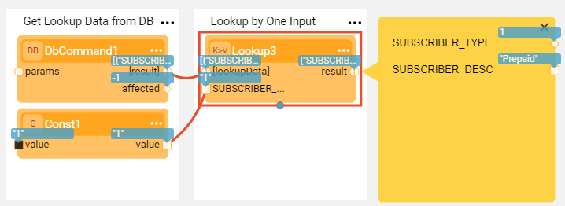
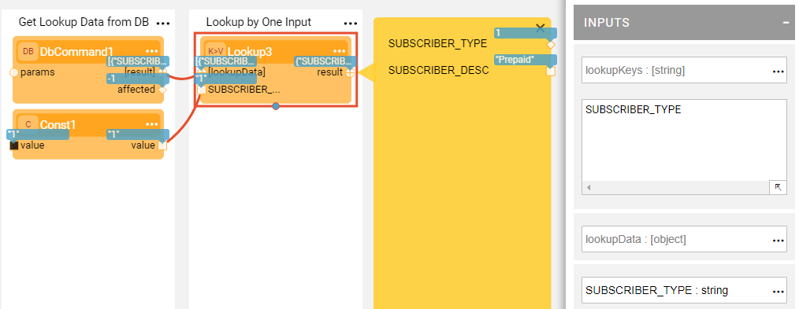
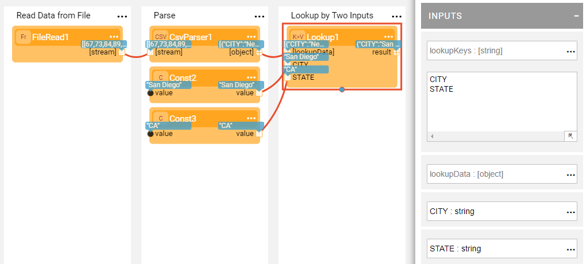
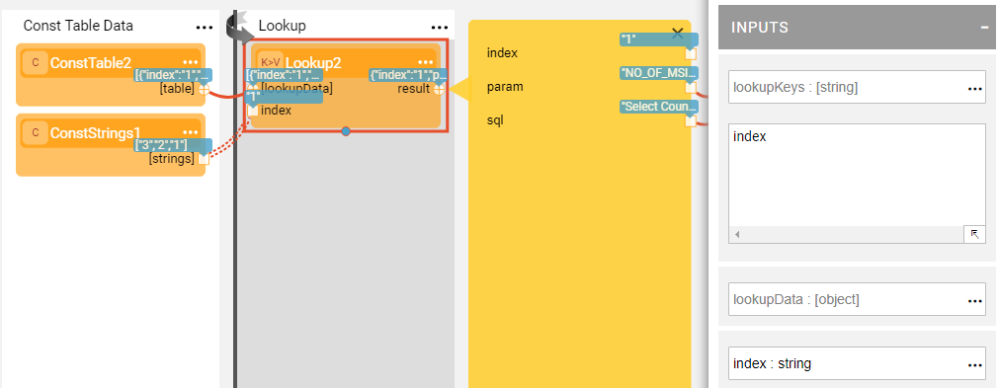

### Lookup Data Using Broadway

Lookup for a data row based on provided input is a common scenario in various population and data transformation flows. 

The Broadway **Lookup** Actor enables performing a data lookup or a dat translation from various sources and based on flexible number of input parameters.

**Example 1 - Lookup Data Based on DB Select**

When a lookup data is coming from a DB, use the **DbCommand** Actor to select the required data. Then in the **lookupKeys** input argument of the **Lookup** Actor, populate the name of the column that will be used as an input for a lookup (or data translation). A new port with the same name will be added to the Lookup Actor. 

Provide an input for a lookup key and run the flow. The Lookup Actor will return the required data row.

**Example 2 - Lookup Data Based on File**

Similar to Example 1, only this time the data is coming from a file rather than from the DB. In this case, use the **FileRead** Actor to read the CSV file and then use the **CsvParser** to parse it.

This example shows that two lookup keys were defined to retrieve the required data row.

**Example 3 - Lookup Data Based on Const Table**

When the data is constant and not supposed to change, a **ConstTable** Actor can be used to store the lookup data. Also in this case, you need to populate the lookupKeys argument with the name of the **ConstTable** Actor's column.

This example shows that you can iterate on the lookup by providing different values to the lookup key.

