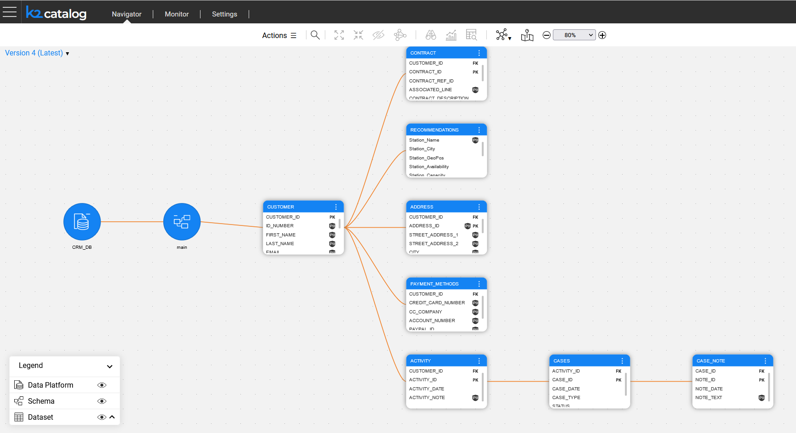

# Fabric 7.2 Discovery and Catalog

Fabric's Discovery and Catalog solution provides an insight into the Fabric interfaces, starting with the RDBMS interface type. The Discovery process includes the following steps:

- Auto-discovery of the data source's elements (schemas, tables, fields) and the existing PK-FK relations between them, while modeling the data source in the *neo4j* GraphDB. 
- Enrichment of the data model by creating additional relations between the data source elements when the PK-FK relations don’t exist. 
- Auto-profiling of the data model elements by both the metadata (field name) and data (field value) to identify PII information and classify it based on pre-defined categories. The auto-profiling process uses a set of pre-defined rules, which can be modified on the project level.

The Discovery process results are presented in a new Catalog application, which allows to:

- Display the Catalog data model as a tree and navigate through its elements.
- View the Catalog’s elements properties and edit them manually, if needed.
- Support multiple Catalog versions and their comparison.
- Search any node by either keywords or an advanced search parameters.
- View and modify the profiling rules.

The Logical Unit creation is based on the discovered and enriched data model. The Masking mechanism can be based on the Catalog profiling and classification.

The Catalog information - including the data model, properties and classifications - is exposed via the Fabric REST APIs.

[Click to read more details](https://support.k2view.com/Academy/articles/39_fabric_catalog/README.htmll).

