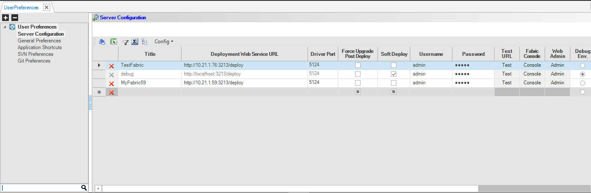

<!--block-->

### Develop on Fabric with IntelliJ

Fabric Studio has been fully integrated with IntelliJ . 

It is mostly recommended if you frequently develop Java functions; you will then benefit from the most advanced code-writing and debugging capabilities available in the market.  

[Read more >](20210822_fabric_intelliJ.md)

<!--block-->

### Soft Deploy

Soft Deploy is Fabric's ability to exclude automatic processes from the LU deployment. 

Soft Deploy is mostly useful for implementers working in a development environment and frequently changing their code, such as Broadway flows or Java functions. They can use the Soft Deploy option to deploy their changes without triggering automatic processes.

[Read more >](20210722_soft_deploy.md)

<!--block-->

### Image Manipulation Actors

Fabric provides a set of built-in image manipulation Actors that allow to perform various activities, such as:

- Load an image into a flow.
- Write text on a given image.
- Clone an image in memory.

Let's check how it works by reviewing the example flow. 

[Read more >](20210701_image_manipulation_actors.md)

<!--block-->

