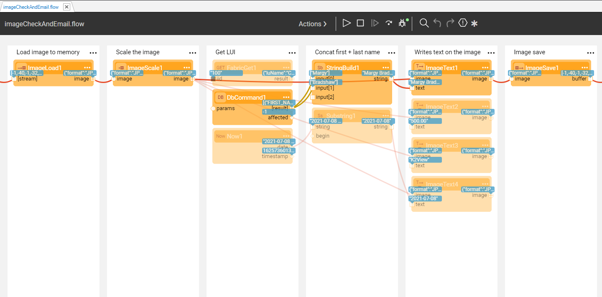

<!--block-->

### The Fabric BI Solution

Fabric includes a business intelligence application called **BI** which is embedded into the Fabric Web Framework. The Fabric BI enables the design and execution of reports and dashboards, and can connect to various data sources to read the data: PostgreSQL, Oracle, Fabric LUI (IID must bee set as a filter) and Common DB. 

[Read more >](20220221_fabric_bi.md)

<!--block-->

### Develop on Fabric with IntelliJ

Fabric Studio has been fully integrated with IntelliJ . 

It is mostly recommended if you frequently develop Java functions; you will then benefit from the most advanced code-writing and debugging capabilities available in the market.  

[Read more >](20210822_fabric_intelliJ.md)

<!--block-->

### Image Manipulation Actors

Fabric provides a set of built-in image manipulation Actors that allow to perform various activities, such as:

- Load an image into a flow.
- Write text on a given image.
- Clone an image in memory.

Let's check how it works by reviewing the example flow. 

[Read more >](20210701_image_manipulation_actors.md)

<!--block-->

