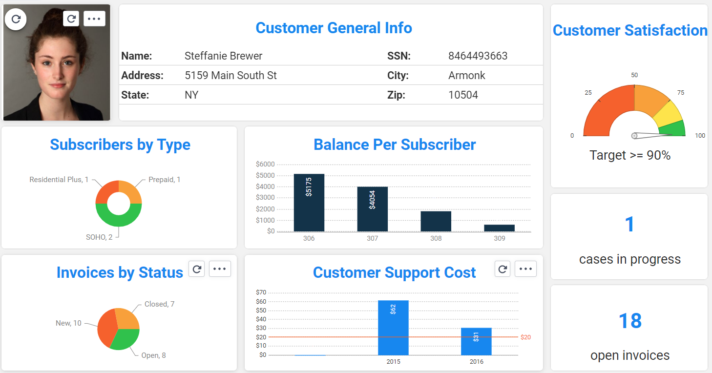

<!--block-->

### Translation or Lookup of Data

Lookup for a data set based on provided input is a common scenario in various population and data transformation flows. 

The Broadway **Lookup** Actor enables performing a data lookup or a data translation from various sources and based on flexible number of input parameters.

[Read more >](20220314_lookup_actor.md)

<!--block-->

### The Fabric BI Solution

Fabric includes a business intelligence application called BI which is embedded into the Fabric Web Framework. The Fabric BI enables the design and execution of reports and dashboards, and can connect to various data sources to read the data: PostgreSQL, Oracle and Fabric itself. 

[Read more >](20220221_fabric_bi.md)

<!--block-->

### Develop on Fabric with IntelliJ

Fabric Studio has been fully integrated with IntelliJ. 

It is mostly recommended if you develop Java functions often. This will allow you to benefit from the most advanced code-writing and debugging capabilities available on the market.  

[Read more >](20210822_fabric_intelliJ.md)

<!--block-->

