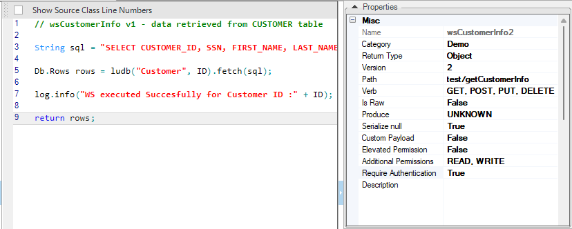

<!--block-->

### Fabric 7.0 Broadway Enhancements

Broadway UI has undergone a major facelift, introducing a new up-to-date coloring scheme.

In addition, several new exciting features and actors have been added. 

[Read more >](https://support.k2view.com/Academy/Release_Notes_And_Upgrade/V7.0/Fabric_Release_Notes_V7.0.0.pdf.html)

<!--block-->

### Sync On Demand

The purpose of a Sync On Demand mode is to reduce the time spent by Fabric performing the LUI sync by synchronizing only the relevant data. 

In this mode, the sync is performed only on tables that are a part of the executed SELECT statement and their parent tables. The sync follows the standard Sync mechanism rules that are based on a LU predefined sync method and sync mode.

[Read more >](https://support.k2view.com/Academy/articles/14_sync_LU_instance/02_sync_modes.html)

<!--block-->

### WS Elevated and Additional Permissions

Fabric Web Services have two properties related to user role permissions:

* Elevated Permission - whether user permissions should be elevated to WS.
* Additional Permissions - enables WS to activate certain methods which are prohibited to the user's role permissions.

[Read more >](20220814_ws_permissions.md)

<!--block-->
