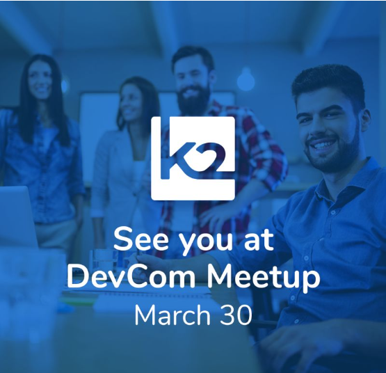

<!--block-->

### K2View DevCom Meetup on March 30

Join us in an interactive session to learn how to build, configure, and expose RESTful data services in minutes – using Graphit, our drag-n-drop, low-code/no-code, visual web-service designer.

[Read more >](webinar_20230330/20230330_Webinar_Agenda.md)

<!--block-->

### K2View DevCom Webinar on February 23rd

The 4th K2View Development Meetup took place on February 23rd - addressing Fabric's Roadmap, BI solution and Web Framework.

[Read more >](webinar_20220223/20220223_Webinar_Agenda_And_Speakers.md)

<!--block-->

### K2View DevCom Webinar on October 27th

The third K2View Development Community Webinar took place on October 27th where we introduced Fabric 7 and our latest TDM tool.

[Read more >](webinar_20211027/20211027_Webinar_Agenda_And_Speakers.md)

<!--block-->

