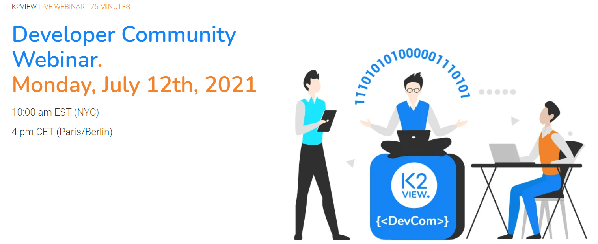
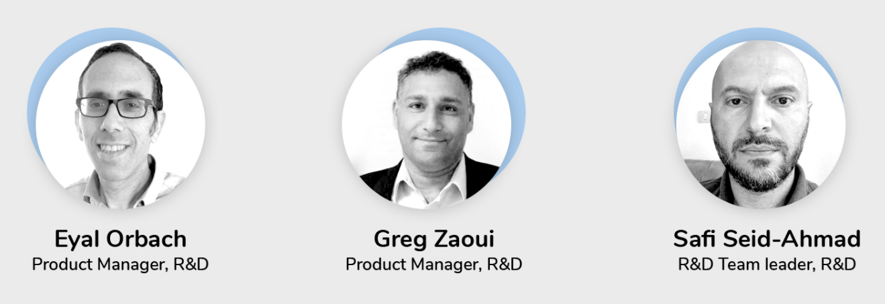

## Webinar Recording 

[Click to watch the Webinar.](https://www.youtube.com/watch?v=sBgpmSd_mDo)

## Webinar Speakers

## Webinar Agenda

**Kick-off (5 mins)** 

- Community Updates
- Blogs & Spotlight sections

**Fabric Next Generation (30 mins)**

- Journey from .Net to a modern and full web-based Studio, enriched with VS Code IDE editing & debugging UX
- On-the-fly spin-up of fully working dev spaces by means of isolated machines containing pre-installed Fabric runtime and all required modules
- Roll-out phases and impact on developers/projects
- Exclusive demo - for the first time to external developers

[Click here to download the Fabric Web Studio presentation](WebStudioCommunityWebinarJul12th.pdf)

**In the spotlight (15 mins)**

- Apply CDC capabilities to inject data into Salesforce DBs
- Use Elastic Search to execute multiple queries across Fabric and Salesforce

[Click here to download the CDC / Elastic Search presentation](CDC&ElasticSearchWebinarJuly12th.pdf)

