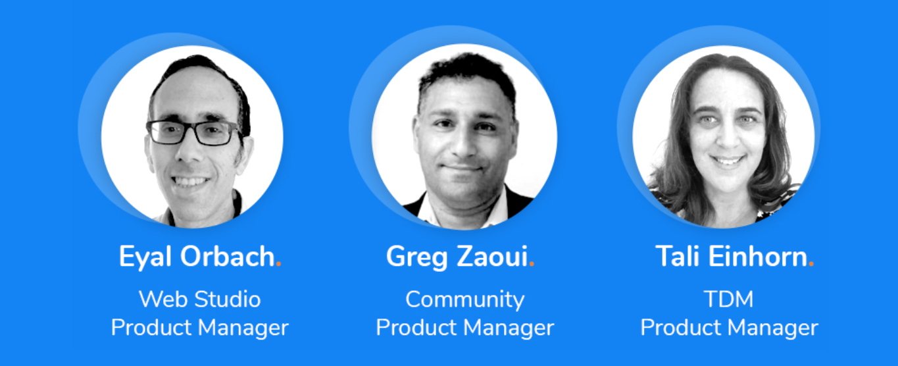

## Webinar Recording 

[Click to watch the Webinar.](https://www.youtube.com/watch?v=sBgpmSd_mDo)

## Webinar Speakers

## Webinar Agenda

**Kick-off (5 mins)** 

- Community Updates

**Fabric Web IDE (30 mins)**

- Journey from the Desktop application to a modern and full web-based Studio, enriched with VS Code IDE editing & debugging UX
- Expedite implementation, Enhance productivity, Simplify operation with Fabric Cloud Platform
- Exclusive demo

[Click here to download the Fabric Web Studio presentation](WebStudioCommunityWebinar211027.pdf)

**Spotlight on Test Data Management  (30 mins)**

- TDM 7 Overview and Architecture
- Demo: Data provisioning using TDM 7 self-service 

[Click here to download the TDM Presentation](TDMWebinar211027.pdf)
