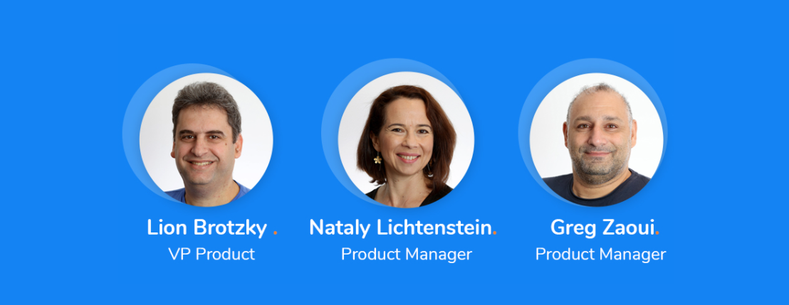

## Webinar Recording 

[Click to watch the Webinar.](https://www.youtube.com/watch?v=akJfFRElHwQ)

## Webinar Speakers

## Webinar Agenda

**Kick-off (5 mins)** 

- Community Updates
- Blogs, Spotlight sections

**K2View Roadmap 2022 (15 mins)**

- New Features
- Market Requirements

[Click here to download the Fabric's 2022 Roadmap presentation](Webinar23022022-ProductRoadmap2022.pdf)

**Spotlight on Fabric BI (20 mins)**

- Fabric Business Intelligence Architecture
- Creating BI Reports

[Click here to download Fabric's BI presentation](Webinar23022022-FabricBI.pdf)

**Web Apps (15 min)**

- Fabric Web framework & City Mobility Demo App
- Create a Simple Web Page

[Click here to download Fabric's Web Framework Presentation](Webinar23022022-FabricWebFramework.pdf)
