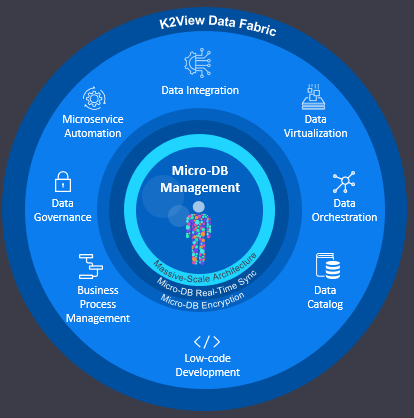

### The Fabric 6.4 official release

We would like to share with you that we have just launched the Fabric 6.4 release which includes the following major features:

1. ##### Data Catalog

   Data Catalog is a new web-based graphical application in the web framework that displays a project’s metadata structure and the relationships between its entities. Providing comprehensive information about organizational data, Data Catalog shows how data is collected, transformed and stored in the data inventory and how it flows from its sources to its targets.

2. ##### Broadway

   Broadway recovery capability was added.

   And much more... The full list can be found in the [Release Notes](https://github.com/k2view-academy/K2View-Academy/blob/Academy_6.4/Release%20Notes/V6.4/Fabric_Release%20Notes%20V6.4.pdf).

