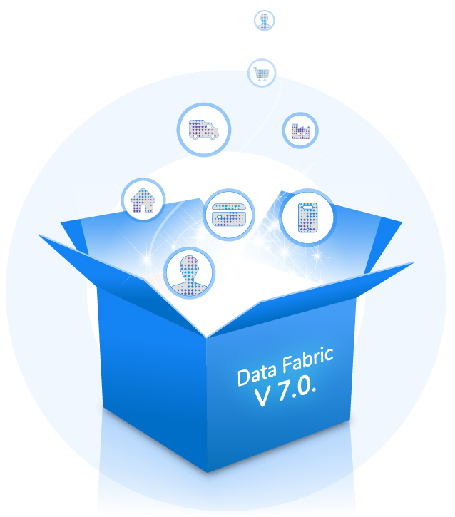

### The Fabric 7.0 Official Release

Fabric 7.0 has just been released and it includes many exciting features:

* The **JDK version** has been upgraded from 8 to 17.
* **AWS Keyspaces and Astra** can now be used as Fabric’s operational layer and storage. 
* **Google Cloud Storage** is introduced as an additional LU Storage type.
* **PubSub Abstraction Layer** enables defining a unified Fabric connection to a message provider (Apache Kafka or JMS). 
* **Sync On Demand** mode allows to reduce the LUI sync time. 
* **Broadway** and **Graphit** now have a modernized UI and many new powerful features. 

And more... See the [Release Notes](https://support.k2view.com/Academy/Release_Notes_And_Upgrade/V7.0/Fabric_Release_Notes_V7.0.pdf.html) and the [Upgrade Procedure to 7.0](https://support.k2view.com/Academy/Release_Notes_And_Upgrade/V7.0/Fabric_Upgrade_Procedure_To_V7.0.pdf.html) documents for the full list.

