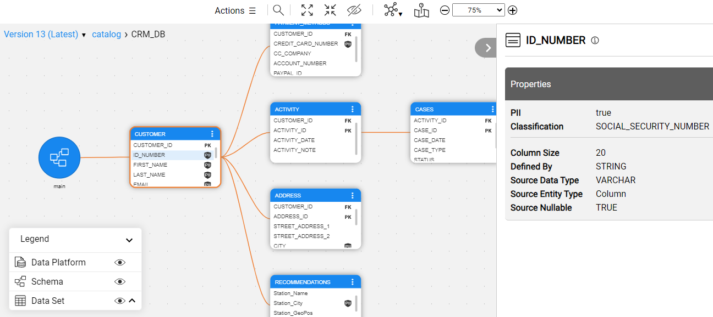

### The Fabric 7.2 Official Release

Fabric 7.2 has just been released and it includes the following:

* **Fabric Catalog (MVP)** - Introducing the Fabric's Discovery and Catalog solution which provides an insight into the Fabric interfaces. The Discovery process performs:
  * Auto-discovery of the data source's elements and the existing PK-FK relations, while modeling it the *neo4j* GraphDB.
  * Data model enrichment creating the missing the PK-FK relations.
  * Auto-profiling of the data model elements by both the metadata and data to identify PII elements and classify them. 
  * The Discovery results are presented in a new Catalog application. The Logical Unit creation and the Masking is now based on the discovered and enriched data model.

See the [Release Notes]() and [Upgrade Procedure to 7.2]() for the full list of features and fixes.

